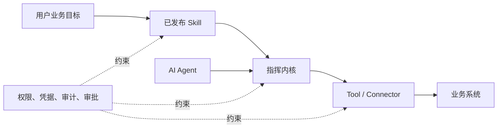

# 企业智能指挥中心同类产品调研

> 调研对象：UiPath、Automation Anywhere、Microsoft Copilot Studio，以及 ServiceNow、SAP、Anthropic 等相邻产品
>
> 调研日期：2026-07-23
>
> 资料范围：厂商官网、官方产品文档、官方帮助中心和官方产品公告
>
> 项目背景：本项目现有《企业智能指挥中心平台骨架与 V1 纵向闭环设计》设计文档

## 1. 调研目的

CommandCenter 的长期目标是建设企业大模型中的智能指挥中心：

1. 接入不同业务系统和不同类型的智能体。
2. 学习员工跨系统工作的操作方式。
3. 把流程化操作沉淀为可复用、可审核、可版本化的 Skill。
4. 代替员工执行 API、浏览器、桌面软件和人工协作混合的任务。
5. 对权限、凭据、风险、成本和全过程进行治理。

本调研重点回答：

- 市场上哪些产品已经具备其中的一部分或大部分能力？
- “录制员工操作并生成可复用能力”目前有哪些实现路线？
- 产品如何组合流程挖掘、RPA、Computer Use、智能体和确定性工作流？
- CommandCenter V1 应该借鉴什么，又应该避免什么？

本文不是采购选型报告。功能、可用区域、预览状态和授权方式可能变化，正式采购或技术集成前仍需按当时版本重新确认。

## 2. 核心结论

### 2.1 市场上已有多个组成部分，但尚无产品完全等同于 CommandCenter 的目标

市场能力大致分成五条路线：

| 路线 | 代表产品 | 最强能力 | 与 CommandCenter 目标的差距 |
|---|---|---|---|
| RPA 向智能体编排升级 | UiPath、Automation Anywhere | UI 自动化、流程发现、机器人、智能体和人工任务的统一编排 | 通常从自动化平台出发，员工示范到业务 Skill 的产品体验仍可继续简化 |
| 低代码智能体与自动化平台 | Microsoft Copilot Studio + Power Automate | Microsoft 生态、连接器、Agent Flow、Computer Use、企业治理 | 能力跨多个产品分布，统一资产模型和端到端体验较复杂 |
| 企业 AI 治理中枢 | ServiceNow AI Control Tower | 跨厂商 AI 资产发现、风险、身份、运行观测和价值度量 | 强于治理，弱于从员工操作学习新流程 |
| 业务流程智能平台 | SAP Signavio + Joule | 企业流程挖掘、SAP 业务语义、流程分析与优化 | SAP 场景最强，跨任意系统的 UI 示范学习不是核心 |
| 通用 Computer Use 与能力封装 | Claude Teach Mode + Agent Skills | 从人类示范中学习自适应 UI 操作；把程序性知识封装为 Skill | 缺少完整企业流程资产、运行控制、权限审批和运营驾驶舱 |

### 2.2 与当前设想最相关的三个市场信号

第一，**UiPath 已经证明“流程发现 + 统一编排 + 持续优化”是一条成立的产品路线**。Process Mining、Task Mining、Maestro、机器人、智能体和人工任务共同构成闭环。

第二，**Claude Teach Mode 证明“展示一次，而不是写一大段提示词”可以成为 Computer Use 的可靠性增强方式**。它记录截图、动作和可选语音说明，执行时将示范作为上下文，在当前界面上推理，而不是机械回放固定坐标。

第三，**企业真正需要的不只是能执行，还要能管理**。UiPath、Automation Anywhere、Microsoft 和 ServiceNow 都把版本、权限、凭据、人工介入、运行记录、评测、成本和审计放在核心位置。

### 2.3 对 CommandCenter 的直接判断

CommandCenter 不应把自己定位成另一个通用 RPA，也不应只做一个可以调用工具的聊天智能体。

更合适的差异化定位是：

> 面向企业自研和异构系统，把员工示范、系统语义事件与 API 能力共同编译成可治理的业务 Skill，再由指挥中心可靠执行。

V1 继续采用纵向闭环是合理的：

```text
主动演示
  → 混合轨迹采集
  → Skill 草稿生成
  → 人工审核和测试
  → 固定版本发布
  → API 与浏览器混合执行
  → 逐步审计和运行反馈
```

## 3. 评价维度

本文使用以下维度比较产品：

1. **流程发现**：能否从系统事件日志还原端到端业务流程。
2. **任务发现**：能否观察员工桌面操作并识别重复任务。
3. **示范学习**：能否把一次人工示范直接作为后续执行依据。
4. **系统接入**：API、连接器、MCP、浏览器、桌面和文档等覆盖范围。
5. **执行编排**：能否组合机器人、智能体、API、规则、文档和人工任务。
6. **复用资产**：流程、机器人、Agent、Tool、Skill 是否可发布和版本化。
7. **人工协作**：审批、异常接管、补充信息和恢复执行。
8. **运行治理**：身份、权限、凭据、审计、评测、风险和成本。
9. **开放程度**：是否能管理第三方模型、智能体和业务系统。
10. **与 CommandCenter 的关系**：可以直接借鉴的机制和需要避开的边界。

---

## 4. UiPath

### 4.1 产品定位

UiPath 已从传统 RPA 平台扩展为 Agentic Automation 平台。其核心产品组合包括：

- **UiPath Maestro**：企业级流程编排与运行控制。
- **Maestro Flow**：面向智能体微流程的轻量编排。
- **Process Intelligence**：结合 Process Mining 与 Task Mining 的流程发现和优化。
- **Studio**：构建 RPA、API 工作流、应用和智能体。
- **Robots**：执行确定性的界面和后台自动化。
- **Agents**：处理需要推理、文本理解和动态决策的步骤。
- **Action Center / Human Tasks**：把任务交给人处理后继续流程。

### 4.2 流程和操作学习

#### Process Mining

Process Mining 使用 ERP、CRM、HRIS、ITSM 等系统的事件日志还原实际流程，可以：

- 展示实际流程路径和变体。
- 识别瓶颈、返工、等待和偏离标准流程的位置。
- 进行根因分析、合规检查和流程模拟。
- 估算自动化机会和投资回报。
- 从 SAP、Oracle、Salesforce、ServiceNow、Workday 等系统提取数据。

它擅长回答“组织实际上怎样运行”，但只能看到业务系统留下的事件。

#### Task Mining

Task Mining 补充系统日志看不到的员工桌面工作：

- 在员工授权下采集桌面交互。
- 分析同一任务的常见步骤和变体。
- 发现重复、手工和适合自动化的操作。
- 支持隐私和敏感数据处理。

它更接近“观察多人如何工作并发现候选流程”，不等同于“员工演示一次后立即生成可发布 Skill”。

#### 闭环

UiPath 的突出特点是把发现结果送入 Maestro 进行编排，再把执行数据反馈给 Process Intelligence，形成：

```text
发现现状 → 设计流程 → 编排执行 → 观察结果 → 持续优化
```

### 4.3 编排和执行

UiPath Maestro 使用 BPMN 2.0 统一描述并执行流程，可以组合：

- UiPath Robots
- AI Agents
- API 和外部系统连接器
- 业务规则与 DMN 决策表
- 文档处理
- 人工任务

重要运行能力包括：

- 流程版本和发布管理。
- 实例级暂停、恢复、重试、重置、回退和跳过。
- 异常、SLA 和瓶颈追踪。
- 基于角色的访问控制和完整审计。
- 对已有 UiPath 工作流、集成和凭据资产的复用。

Maestro Flow 更适合较小的 Agentic Microflow，把确定性步骤与智能判断放在同一执行图中，并提供重试、补偿、Trace 和评测。

### 4.4 优势

- RPA 和桌面自动化积累深，适合没有 API 的老系统。
- 流程挖掘、任务挖掘、构建、执行和监控链路完整。
- BPMN 模型既是设计模型也是执行模型，减少设计与运行分离。
- 机器人、智能体、规则和人工任务可以在一个流程中协同。
- 企业级运行控制和审计能力成熟。

### 4.5 局限与注意事项

- 平台能力多，建设和治理复杂度较高。
- Task Mining 更偏向批量发现和分析，并不是极简的“一次演示生成 Skill”体验。
- 深度能力通常依赖 UiPath 自身资产体系。
- 对简单 V1 而言，完整 BPMN、流程挖掘和运营体系可能过重。

### 4.6 对 CommandCenter 的启示

应借鉴：

- 发现、编排、执行反馈的闭环。
- 确定性流程为骨架，智能体只负责明确的非确定性步骤。
- 运行实例级的暂停、恢复、重试和人工介入。
- Skill 发布版本与历史运行实例绑定。

暂不照搬：

- V1 不需要完整 BPMN 设计器。
- 不从大规模后台 Task Mining 开始。
- 不同时建设全部流程分析和 CoE 管理模块。

官方资料：

- [UiPath Maestro](https://www.uipath.com/product/maestro)
- [UiPath Process Intelligence](https://www.uipath.com/product/maestro/process-intelligence)
- [UiPath Task Mining](https://www.uipath.com/product/task-mining)
- [UiPath Studio](https://www.uipath.com/product/studio)
- [UiPath Maestro Flow](https://www.uipath.com/product/maestro/flow)

---

## 5. Automation Anywhere

### 5.1 产品定位

Automation Anywhere 将其新平台定位为 Agentic Process Automation（APA），主要组件包括：

- **Mozart Orchestrator**：目标驱动的智能体流程编排。
- **Process Reasoning Engine（PRE）**：理解业务目标、上下文和下一步动作。
- **AI Agent Studio**：构建受治理的企业 AI Agent。
- **Automation Co-Pilot**：让员工在工作界面中调用自动化和智能体。
- **Process Discovery**：发现桌面操作和自动化机会。
- **RPA / Automation Workspace**：构建和运行传统自动化。
- **Document Automation**：文档提取和处理。
- **AI Governance / CoE Manager**：治理、运营和价值管理。

### 5.2 流程和操作学习

Process Discovery 通过传感器采集员工跨应用交互并进行分析：

- 识别常见任务和操作路径。
- 生成工作流视图和流程变体。
- 发现适合自动化的候选任务。
- 可生成流程设计材料或自动化原型。
- 通过隐私组件处理敏感信息。

它与 UiPath Task Mining 类似，适合从多人、多次操作中发现模式。其重点是“发现值得自动化的流程”，而不是把每次示范直接变成运行中的能力。

### 5.3 编排和执行

Mozart Orchestrator 的产品方向比传统固定工作流更动态：

- 根据业务目标和当前上下文选择下一步。
- 协调 AI Agent、RPA Bot、API、文档和人工任务。
- 支持时间和事件触发。
- 记录智能体决策与动作，提供可解释和可审计的运行轨迹。
- 支持自愈、异常处理、集中策略和运行护栏。
- 通过 MCP 和 A2A 等协议连接不同工具与智能体。

这意味着 Automation Anywhere 正在把“预先画好每个步骤”的 RPA 编排，扩展为“在边界内动态决定路径”的智能体流程。

### 5.4 优势

- RPA、文档自动化和桌面工作发现能力成熟。
- 强调跨智能体、机器人、API 和人的动态编排。
- MCP、A2A 和第三方模型方向较开放。
- 提供云、私有和混合部署选择。
- 治理与自动化 CoE 体系完整。

### 5.5 局限与注意事项

- Mozart、PRE 等新能力的公开信息中包含较多平台愿景，实际版本、可用范围和授权需要单独确认。
- 动态目标驱动编排提高灵活性，也会增加测试、复现和责任界定难度。
- 操作发现与可执行资产之间仍需要设计、审核和工程化过程。

### 5.6 对 CommandCenter 的启示

应借鉴：

- 把 Agent、Bot、API、文档和人工任务统一视为可编排执行者。
- 保留智能决策的原因、输入上下文和实际动作。
- 连接层考虑 MCP/A2A 等开放协议，但不能把协议等同于业务 Skill。
- 长期可从多次运行中学习异常恢复和更优路径。

需要控制：

- V1 不采用完全动态的目标驱动编排。
- 每个 Skill 的关键写步骤、成功条件和人工确认点必须显式。
- “自愈”不能静默改变已发布 Skill 的业务含义。

官方资料：

- [Automation Anywhere 产品组合](https://www.automationanywhere.com/products)
- [Mozart Orchestrator](https://www.automationanywhere.com/products/mozart-orchestrator)
- [Agentic Process Automation System](https://www.automationanywhere.com/products/agentic-process-automation-system)
- [Process Discovery 官方文档](https://docs.automationanywhere.com/r/process-discovery-overview)

---

## 6. Microsoft Copilot Studio + Power Automate

### 6.1 产品定位

Microsoft 的相关能力分布在多个产品中：

- **Copilot Studio**：低代码创建 Agent，配置知识、指令、Topic、Tool 和 Trigger。
- **Agent Flows**：在 Copilot Studio 中创建确定性、可重复的工作流。
- **Computer Use**：让 Agent 操作网站和 Windows 应用。
- **Power Automate Cloud Flows**：连接 SaaS、API 和 Microsoft 365 服务。
- **Power Automate Desktop Flows**：录制和执行 Windows 桌面 RPA。
- **Process Mining / Task Mining**：分析流程和用户录制操作。
- **Dataverse、Power Platform Admin Center、Purview**：数据、环境、管理和审计基础设施。

因此 Microsoft 的优势不是一个单独的“指挥中心”产品，而是一个覆盖 Agent、低代码工作流、连接器、桌面自动化和企业管理的生态。

### 6.2 Agent 与确定性流程

Copilot Studio Agent 可以组合：

- 模型和系统指令。
- 企业知识和上下文。
- Topic 与对话逻辑。
- Connector、API、Flow 和 Computer Use 等工具。
- 手动、事件、计划和 Agent 触发器。

Agent Flow 用于需要一致执行的步骤，适合把计算、数据转换、API 调用和业务规则从大模型自由决策中分离出来。

这个分工对 CommandCenter 很重要：

```text
Agent：理解目标、选择能力、处理非结构化信息
Flow / Skill：按受控规则完成可审计的业务动作
```

### 6.3 Computer Use

Copilot Studio Computer Use 可以通过鼠标和键盘操作网站及桌面应用，即使目标系统没有 API。

独立 Computer Use 工具提供：

- 可复用的输入和输出。
- 草稿、测试、发布生命周期。
- 作为 Agent Tool 使用，或被 Agent Flow 引用。
- 保存并加密凭据。
- 网站和应用允许清单。
- 活动记录、步骤日志、截图和 Session Replay。
- 执行时长、成功率等运行指标。
- 需要时暂停并交给人工处理。

运行环境可包括托管浏览器、Windows 365 Cloud PC 池或自带 Power Automate Machine，具体可用方式受区域、版本和授权影响。

值得注意的是，Microsoft 官方明确说明：Computer Use 的人工监督触发具有概率性，**不能被当作安全故障保护或强制策略执行机制**。关键安全边界仍需依靠权限、环境隔离、允许清单和确定性审批。

### 6.4 桌面录制与 Task Mining

Power Automate Desktop Recorder 可以：

- 记录鼠标和键盘操作。
- 根据 UI 元素生成浏览器和桌面自动化动作。
- 使用 UIA、MSAA 等方式形成元素选择器。
- 允许开发者继续编辑生成的 Desktop Flow。

Task Mining 则分析用户录制的操作：

- 找出常见步骤和错误。
- 识别适合自动化的任务。
- 推荐连接器或 Desktop Flow。

二者说明“录制”存在两种不同用途：

1. **录制生成确定性 RPA**：把 UI 元素和动作转换为可编辑 Flow。
2. **录制用于流程分析**：从多次样本中发现模式和机会。

### 6.5 优势

- Microsoft 365、Dynamics 365、Azure 和 Windows 生态集成强。
- Connector 数量和低代码用户基础大。
- Agent、确定性 Flow、桌面 RPA 和 Computer Use 可组合。
- Dataverse、环境、DLP、Purview 和身份体系可以支撑企业治理。
- Computer Use 已包含独立发布、运行回放和人工介入等产品化能力。

### 6.6 局限与注意事项

- 能力跨 Copilot Studio、Power Automate、Dataverse、Purview 和 Windows 运行环境分布，理解和配置成本较高。
- Desktop Recorder 生成的是 UI 自动化动作，不会自动理解完整业务意图、前置条件和成功标准。
- Computer Use 具有模型概率性，敏感操作不能只依赖提示词或模型自行请求审批。
- 部分能力可能处于 Preview、分区域发布或需要额外授权。

### 6.7 对 CommandCenter 的启示

应借鉴：

- Computer Use 也应成为可独立测试、发布、引用和监控的资产。
- 每个 UI 自动化定义输入、输出、允许访问范围和凭据引用。
- 保存步骤日志、截图、页面状态和执行回放。
- 人工接管后可以从中断点继续。
- 明确区分 Agent 的概率判断和强制安全策略。

差异化机会：

- CommandCenter 用统一 `SkillSpec` 把 API、浏览器动作、语义事件、人工确认和业务成功条件放在同一资产中。
- 面向企业自研系统提供更轻量的语义采集 SDK。
- 把一次主动演示直接转化成业务可读的 Skill 草稿，而不只是低层 Desktop Flow。

官方资料：

- [Copilot Studio 概述](https://learn.microsoft.com/en-us/microsoft-copilot-studio/fundamentals-what-is-copilot-studio)
- [Agent Flows 概述](https://learn.microsoft.com/en-us/microsoft-copilot-studio/flows-overview)
- [Standalone Computer Use](https://learn.microsoft.com/en-us/microsoft-copilot-studio/computer-use-standalone)
- [Computer Use 人工监督](https://learn.microsoft.com/en-us/microsoft-copilot-studio/human-supervision-computer-use)
- [Computer Use 运行环境](https://learn.microsoft.com/en-us/microsoft-copilot-studio/configure-where-computer-use-runs)
- [Computer Use 运行监控](https://learn.microsoft.com/en-us/microsoft-copilot-studio/monitor-computer-use)
- [Power Automate Desktop Recorder](https://learn.microsoft.com/en-us/power-automate/desktop-flows/recording-flow)
- [Power Automate Task Mining](https://learn.microsoft.com/en-us/power-automate/task-mining-overview)

---

## 7. ServiceNow

### 7.1 产品定位

ServiceNow 的相关能力分为两个重点：

- **AI Agent Studio / AI Agent Orchestrator**：在 Now Platform 上创建、测试和编排 Agentic Workflow。
- **AI Control Tower**：跨厂商发现、治理、保护、观察和度量 AI 资产。

ServiceNow 的独特优势来自 CMDB、身份、IT 服务管理和企业工作流基础。它更像“所有企业 AI 的治理控制平面”，而不是以桌面操作学习为核心的自动化产品。

### 7.2 Agent 构建和工作流

AI Agent Studio 提供：

- 创建、管理和测试 AI Agent。
- 创建自执行的 Agentic Workflow。
- 使用预制 Agent 和流程模板。
- 把 Agent 接入 ServiceNow 的业务工作流和数据上下文。

这类能力适合 IT、客服、HR 等本来就在 ServiceNow 平台内运行的任务。

### 7.3 AI Control Tower

AI Control Tower 的能力可归纳为五类：

1. **Discover**：发现企业内部和第三方平台中的 Agent、模型、MCP Server、身份等 AI 资产。
2. **Observe**：持续监控运行行为、推理链路、性能和异常。
3. **Govern**：管理资产生命周期、风险、合规框架和审计证据。
4. **Secure**：识别非人身份和权限暴露，实施最小权限，并在越权时阻断。
5. **Measure**：追踪成本、采用情况、业务价值和投资回报。

官方公布的连接范围包括 AWS、Google Cloud、Microsoft Azure、SAP、Oracle、Workday 等生态。资产与 ServiceNow CMDB 和业务服务关系关联，因此可以回答：

- 这个 Agent 属于哪个业务能力？
- 使用了什么模型、数据和身份？
- 谁负责它？
- 当前风险、成本和运行表现如何？
- 出现异常时能否停止？

### 7.4 优势

- 跨厂商 AI 资产的治理定位清晰。
- 资产、身份、业务服务、风险和运行指标可以关联。
- 适合建立企业 AI 清单、责任边界和合规流程。
- 提供运行观测、最小权限和 Kill Switch 等企业控制能力。

### 7.5 局限与注意事项

- 不以员工桌面操作录制和 Task Mining 为核心。
- 对非 ServiceNow 业务流程的执行深度依赖连接器和集成。
- 更适合作为治理层，而不是 CommandCenter V1 的学习执行引擎。

### 7.6 对 CommandCenter 的启示

CommandCenter 完整版应具备类似的控制平面，但 V1 只需要最小闭环：

- System、Tool、Skill、Agent、Run 都有稳定身份。
- 每个资产有负责人、版本、权限范围和状态。
- 每次运行可追溯模型、Skill、工具、凭据引用和操作人。
- 未来增加成本、评测、风险级别和紧急停用。

一个重要设计原则是：

> Skill Registry 管“企业会做什么”，AI Control Plane 管“这些能力由谁、用什么权限、在什么风险边界内运行”。

官方资料：

- [ServiceNow AI Control Tower](https://www.servicenow.com/products/ai-control-tower.html)
- [AI Control Tower 2026 产品公告](https://newsroom.servicenow.com/press-releases/details/2026/ServiceNow-expands-AI-Control-Tower-to-discover-observe-govern-secure-and-measure-AI-deployed-across-any-system-in-the-enterprise/default.aspx)
- [ServiceNow AI Agent Studio 文档](https://www.servicenow.com/docs/r/intelligent-experiences/ai-agent-studio.html)
- [AI Discovery Setup 文档](https://www.servicenow.com/docs/en-US/bundle/yokohama-intelligent-experiences/page/administer/ai-governance-workspace/concept/ai-discovery-setup.html)

---

## 8. SAP Signavio + Joule

### 8.1 产品定位

SAP 的组合路线是：

- **SAP Signavio** 提供流程建模、流程挖掘、流程智能和转型管理。
- **Joule** 提供对话式入口、业务 Agent 和跨 SAP 应用的执行体验。
- **Joule Studio / AI Agent Hub** 提供 Agent、应用和工作流构建、运行与治理。

其核心竞争力不是通用桌面控制，而是 SAP 业务对象、领域模型、知识图谱和端到端流程上下文。

### 8.2 流程发现与分析

Signavio 可以：

- 从事件数据重建实际业务流程。
- 比较流程变体、瓶颈和偏离。
- 进行流程建模、仿真、绩效分析和改进。
- 使用 Process Consulting Agent 通过自然语言分析瓶颈、指标和改进机会。

Joule 在 Signavio 中提供三类能力：

- **Informational**：查询流程内容、指标和业务知识。
- **Navigational**：定位流程模型、旅程和改进资产。
- **Transactional**：创建、修改或删除 Signavio 中的流程资产。

### 8.3 Agent Mining

SAP 提出的 Agent Mining 关注的不是员工操作，而是 Agent 自身：

- 发现企业中运行的 Agent。
- 追踪 Agent 的行为、决策、上下文和流程影响。
- 比较 Agent 对周期、成本、质量和合规的影响。
- 分析 SAP、第三方和自建 Agent。

这为 CommandCenter 的后期演进提供了不同视角：

```text
Task Mining：学习员工怎样做
Process Mining：理解企业流程怎样运行
Agent Mining：观察智能体实际上怎样做
```

三者应共享统一业务对象、流程实例和指标，而不是形成三个孤立系统。

### 8.4 优势

- SAP 业务语义和流程上下文深。
- 流程模型、真实运行数据和改进建议能够关联。
- Joule 可在多个 SAP 应用中提供统一交互体验。
- 适合大企业端到端流程优化和转型治理。

### 8.5 局限与注意事项

- 在 SAP 生态中优势最明显。
- 对异构自研系统的深度取决于数据接入和集成质量。
- 流程挖掘需要高质量事件日志和统一业务键。
- Joule 在不同 Signavio 模块中的可用能力和授权并不完全相同。

### 8.6 对 CommandCenter 的启示

应借鉴：

- 采集时必须保留业务对象和业务主键，不能只有点击坐标。
- Skill 运行记录应关联到真实业务流程实例。
- 长期同时建设 Task、Process 和 Agent 三类分析视角。
- 业务指标是判断 Skill 是否有价值的最终标准，不能只看“自动运行成功”。

V1 中的具体落地是：

- `office_task_id`、`purchase_request_id` 作为跨系统关联键。
- 记录任务从库存不足到采购中的业务状态变化。
- 除技术成功率外，统计人工耗时、执行时长、重复提交和异常数。

官方资料：

- [Joule with SAP Signavio 官方公告](https://news.sap.com/2026/02/process-conversation-joule-sap-signavio-solutions-generally-available/)
- [Joule in SAP Signavio 官方文档](https://help.sap.com/docs/joule/capabilities-guide/joule-in-sap-signavio-process-transformation-suite)
- [SAP Signavio AI 能力清单](https://help.sap.com/docs/signavio-process-transformation-suite/signavio-process-transformation-suite-administration-guide/86da77e4ad1f488ab0e18696617f233c.html)
- [Joule Studio 官方公告](https://news.sap.com/2026/05/new-joule-studio-enterprise-scale-agentic-development/)
- [SAP Signavio Agent Mining](https://news.sap.com/2025/11/how-sap-signavio-agent-mining-transforms-enterprise-ai/)

---

## 9. Anthropic：Claude Teach Mode + Agent Skills

### 9.1 为什么纳入调研

Anthropic 目前不是 UiPath 或 ServiceNow 式的完整企业指挥中心，但它的两个能力与 CommandCenter 的核心设想高度相关：

- **Teach Mode**：通过人类示范提高浏览器和 Computer Use 工作流的可靠性。
- **Agent Skills**：把程序性知识、脚本和资源封装成可复用能力。

二者分别回答：

- 系统怎样从员工示范中获得执行依据？
- 学会后的能力怎样被组织和复用？

### 9.2 Teach Mode

Anthropic 官方介绍的 Teach Mode 模式是：

1. 用户实际执行一次任务。
2. 系统记录每一步的截图、动作和可选语音说明。
3. 再次执行时，把完整示范作为模型上下文。
4. 模型参考示范，但根据当前页面状态寻找等价元素。

它与传统宏录制的关键区别是：

> 回放不是严格重复历史坐标，而是把示范当作可适应当前界面的执行规范。

因此即使按钮位置变化、菜单调整或页面状态不同，模型仍可能识别同一业务意图。

Teach Mode 可以：

- 提高模型本来大多能完成、但偶尔失败的流程可靠性。
- 解锁仅靠文字提示难以描述的操作。
- 同时适用于浏览器和桌面环境。

### 9.3 Agent Skills

Agent Skill 是包含以下内容的文件夹：

- 元数据和适用场景。
- `SKILL.md` 指令。
- 可选脚本。
- 参考资料、模板和其他资源。

Claude 根据任务动态发现 Skill，并采用渐进式加载：

1. 先读取少量元数据判断是否相关。
2. 相关时再读取完整指令。
3. 只有需要时才加载脚本或资源。

Skill 适合封装：

- 组织流程和合规要求。
- 特定领域知识。
- 文档、分析和研发规范。
- 与 MCP 工具组合使用的方法。

Anthropic 对 Skill 和 MCP 的边界定义很有参考价值：

```text
MCP：让 Agent 能接触外部系统和工具
Skill：教 Agent 如何按照组织方式使用这些工具
```

### 9.4 Teach Mode 与 Skill 不是同一个概念

需要避免一个常见混淆：

| 对象 | 本质 | 主要内容 |
|---|---|---|
| Teach Mode 录制 | 一次人类示范 | 截图、动作、页面状态、说明 |
| Saved Workflow | 可再次调用的示范工作流 | 示范上下文和运行入口 |
| Agent Skill | 可移植的程序性知识包 | 指令、脚本、参考资料和资源 |
| CommandCenter Skill | 可治理的企业业务能力 | 输入输出、工具、步骤、规则、审批、成功条件、版本和权限 |

CommandCenter 可以吸收前三者的优点，但企业 Skill 还必须补齐确定性结构、运行状态和治理信息。

### 9.5 优势

- 示范学习路径非常直接，符合“show, don't tell”。
- 执行时可以适应界面变化，而不是只依赖坐标。
- Skill 结构简单、开放、可组合，并支持按需加载。
- MCP 与 Skill 的职责边界清楚。

### 9.6 局限与注意事项

- 一次成功示范不代表已经覆盖分支、异常和权限边界。
- Computer Use 本质上仍有概率性，不能替代强校验和审批。
- Agent Skill 是程序性知识包，不天然包含企业运行实例、补偿、SLA 和业务审计。
- 仅保存截图与动作不足以得到稳定的跨系统数据映射。

### 9.7 对 CommandCenter 的启示

CommandCenter 的 Skill 编译器应把 Teach Mode 思路与企业结构化轨迹结合：

```text
截图与界面动作
  + 页面语义元素
  + API 请求和响应摘要
  + 业务系统语义事件
  + 员工可选讲解
  → Operation Trace
  → 结构化 Skill 草稿
```

执行时采用两层策略：

- 已识别的稳定 API 和页面元素使用确定性步骤。
- 页面发生小幅变化时，Computer Use 模型基于示范寻找等价操作。
- 业务条件不满足、敏感写入或界面变化过大时停止并请求人工处理。

官方资料：

- [Anthropic：Computer Use 与 Teach Mode 最佳实践](https://claude.com/blog/best-practices-for-computer-and-browser-use-with-claude)
- [Anthropic：Skills Explained](https://claude.com/blog/skills-explained)
- [Anthropic：Introducing Agent Skills](https://claude.com/blog/skills)
- [Claude Help Center：What are Skills?](https://support.claude.com/en/articles/12512176-what-are-skills)
- [Anthropic：Skills 与 MCP](https://claude.com/blog/extending-claude-capabilities-with-skills-mcp-servers)

---

## 10. 横向功能对比

图例：

- **强**：产品核心能力且链路较完整。
- **中**：具备相关能力，但不是最主要优势或分散在多个模块。
- **弱**：需要较多定制、依赖相邻产品，或不是产品重点。
- **—**：未发现明确的对应能力。

| 维度 | UiPath | Automation Anywhere | Microsoft | ServiceNow | SAP | Anthropic |
|---|---|---|---|---|---|---|
| Process Mining | 强 | 中 | 中 | 弱 | 强 | — |
| Task Mining | 强 | 强 | 中 | — | 弱 | — |
| 一次示范驱动 Computer Use | 中 | 中 | 中 | — | — | 强 |
| 确定性桌面 RPA | 强 | 强 | 强 | 弱 | 弱 | 弱 |
| 自适应 Computer Use | 中 | 中 | 强 | 弱 | 弱 | 强 |
| API / Connector | 强 | 强 | 强 | 强 | 强 | 中，主要经 MCP |
| Agent 构建 | 强 | 强 | 强 | 强 | 强 | 强 |
| Agent + Bot + API + 人统一编排 | 强 | 强 | 强 | 中 | 中 | 弱 |
| 确定性流程编排 | 强 | 强 | 强 | 强 | 强 | 弱 |
| 人工审批与接管 | 强 | 强 | 强 | 强 | 强 | 中 |
| 可复用能力资产 | Workflow / Agent | Bot / Agent / Process | Agent / Flow / Tool | Agent / Workflow | Process / Agent | Skill / Workflow |
| 版本、运行和审计 | 强 | 强 | 强 | 强 | 强 | 中 |
| 跨厂商 AI 治理 | 中 | 中 | 中 | 强 | 中 | 弱 |
| 业务流程语义深度 | 强 | 强 | 中 | 强于 ServiceNow 域 | 强于 SAP 域 | 依赖上下文 |
| 适合 CommandCenter V1 直接模仿 | 编排和状态控制 | 执行者统一模型 | Tool 生命周期与回放 | 最小治理模型 | 业务键和价值指标 | 示范学习与 Skill 封装 |

说明：

- 此表是基于公开官方资料的产品能力归纳，不代表同一部署版本已默认包含全部功能。
- “一次示范驱动 Computer Use”与传统录制生成 RPA 不完全相同。
- “强”不代表开箱即用，企业实施仍依赖数据、权限、连接器和流程治理。

## 11. 四种“学习流程”方式不能混为一谈

### 11.1 Process Mining

输入：

- ERP、CRM、OA 等系统事件日志。

输出：

- 实际端到端流程、变体、瓶颈、合规偏差和改进机会。

优点：

- 可以观察大规模、长期、真实运行的业务流程。

限制：

- 看不到没有写入事件日志的桌面操作。
- 发现流程不等于生成可以立即执行的 Skill。

### 11.2 Task Mining

输入：

- 多名员工在桌面或浏览器中的操作记录。

输出：

- 常见任务路径、变体、重复步骤和自动化候选。

优点：

- 能补齐系统日志看不到的手工工作。

限制：

- 数据采集、隐私和员工接受度要求高。
- 需要多次样本、聚类和人工解释。

### 11.3 Recorder-to-RPA

输入：

- 一次鼠标、键盘和 UI 元素录制。

输出：

- 可编辑的确定性自动化步骤。

优点：

- 快速生成可运行骨架。

限制：

- 容易停留在界面动作层，缺少业务目标、变量、成功条件和异常规则。
- 页面变化可能导致选择器失效。

### 11.4 Demonstration-to-Agent

输入：

- 一次人类示范，包括截图、动作、状态和讲解。

输出：

- 模型可以参考并适应当前界面执行的示范规范。

优点：

- 易用，能够处理一定的界面变化。

限制：

- 结果具有概率性。
- 单次示范通常没有覆盖分支、异常和风险边界。

### 11.5 CommandCenter 应采用混合路线

V1：

- 主动演示。
- 语义事件 + API 证据 + UI 动作 + 截图。
- AI 生成结构化 Skill 草稿。
- 人工补齐异常、审批和成功条件。

后续：

- 多次示范比较和变体学习。
- 授权范围内的 Task Mining。
- 通过业务事件日志做 Process Mining。
- 通过运行 Trace 做 Agent Mining 和 Skill 持续评测。

## 12. 对 CommandCenter 平台骨架的映射

| CommandCenter 模块 | 优先借鉴对象 | 借鉴内容 |
|---|---|---|
| 操作采集器 | Anthropic、Microsoft、UiPath | 示范记录、UI 元素、截图、语音说明、隐私控制 |
| 轨迹规范化 | UiPath、Automation Anywhere、SAP | 跨应用步骤、流程变体、业务对象和关联键 |
| Skill 编译器 | Anthropic Skills、Microsoft Flow | 程序性知识封装、输入输出、可编辑结构 |
| Skill Registry | Anthropic、UiPath、Microsoft | 元数据、版本、发布、引用和复用 |
| 指挥内核 | UiPath Maestro、Mozart | Agent、Bot、API、人统一编排与状态控制 |
| Connector | Microsoft、UiPath、MCP | API 优先、UI 兜底、开放连接协议 |
| 人工确认 | Microsoft、UiPath、ServiceNow | 强制审批、异常接管、恢复执行 |
| 运行观测 | Microsoft、UiPath、ServiceNow | Step Log、截图、Replay、Trace、指标和告警 |
| 企业治理 | ServiceNow、Microsoft | 资产清单、身份、权限、风险、审计、成本 |
| 持续改进 | UiPath、SAP | Process / Task / Agent Mining 和业务价值评估 |

## 13. V1 产品设计建议

### 13.1 第一版必须完成

1. **主动演示会话**
   - 明确开始、结束和操作人。
   - 只采集选定测试系统。
   - 可以补充语音或文字说明。

2. **混合 Operation Trace**
   - 业务语义事件。
   - API 工具调用摘要。
   - 页面 URL、语义元素和动作。
   - 必要截图。
   - 脱敏和凭据排除。

3. **结构化 Skill 草稿**
   - 业务目标。
   - 输入输出。
   - 前置条件。
   - 有序步骤和数据映射。
   - 人工确认点。
   - 成功条件。
   - 超时、重试和失败处理。

4. **审核、测试和发布**
   - AI 只能生成草稿。
   - 管理员可以编辑。
   - 测试通过后生成不可静默修改的版本。

5. **混合执行**
   - API 优先。
   - 浏览器操作兜底。
   - 小幅页面变化允许模型寻找等价元素。
   - 高风险动作强制人工确认。

6. **可追溯运行**
   - 绑定 Skill 版本。
   - 每步记录状态、输入输出摘要和错误。
   - 保存必要截图和页面证据。
   - 支持暂停、人工处理和继续。

### 13.2 第一版暂不做

- 企业范围的长期后台 Task Mining。
- 通用 Process Mining 平台。
- 完整 BPMN / DMN 设计器。
- 完全动态、自主改变路径的 Agent Orchestrator。
- 管理所有第三方 Agent 的完整 AI Control Tower。
- 无审核的自动 Skill 发布和自我修改。
- 覆盖所有 Windows 软件和远程桌面环境。

### 13.3 必须从第一版保持的边界



- Agent 不直接绕过 Tool 访问业务系统。
- Tool 只描述原子技术能力，不携带完整业务流程。
- Skill 描述可审核的业务能力，不保存明文凭据。
- Orchestrator 固定到具体 Skill 版本执行。
- Governance 是运行约束，不是上线后再补的展示页面。

## 14. 可形成的差异化能力

### 14.1 企业自研系统的语义采集 SDK

传统 Task Mining 只能从页面猜测业务含义。CommandCenter 可以让测试系统和后续自研系统主动发出：

- 当前业务对象类型和 ID。
- 当前动作业务含义。
- 字段语义和敏感级别。
- 操作前后业务状态。
- 对应 API 或 Tool。

这会显著提高 Skill 编译质量，并减少对视觉和 DOM 的依赖。

### 14.2 Demonstration + Specification 双层 Skill

Skill 同时保留：

- **Specification**：输入输出、规则、步骤、审批和成功条件。
- **Demonstration Evidence**：截图、动作、元素、讲解和原始轨迹。

执行器优先使用 Specification，界面变化或步骤歧义时参考 Demonstration Evidence。

### 14.3 业务可读而不是只对开发者可读

管理员看到的 Skill 应表达：

```text
读取库存不足任务
→ 确认采购内容
→ 创建采购申请
→ 回写采购单号
```

而不是直接展示：

```text
click div:nth-child(4)
→ type input[name=q]
→ wait 2000ms
```

底层选择器和坐标仍可作为执行证据，但不能成为 Skill 的主语义。

### 14.4 从一次示范逐步演进到组织能力学习

```text
一次主动示范
  → 可复用 Skill
  → 多次示范比较
  → 识别分支和变体
  → 长期 Task / Process Mining
  → 运行反馈与 Agent Mining
  → 企业能力持续优化
```

这条路线兼顾第一版可行性和长期产品空间。

## 15. 主要风险

### 15.1 把“录下来”误认为“学会了”

一次演示没有包含：

- 输入变化。
- 分支条件。
- 权限不足。
- 系统超时。
- 重复提交。
- 业务拒绝。
- 补偿和人工处理。

因此生成物必须是“待审核草稿”，不能直接成为生产 Skill。

### 15.2 把模型自适应误认为确定性可靠

Computer Use 可以适应小幅 UI 变化，但仍可能：

- 点击错误对象。
- 误读页面状态。
- 受到页面内容提示注入。
- 在不完整信息下继续执行。

关键写操作必须有业务校验、最小权限、允许范围和人工确认。

### 15.3 只记录技术成功，不记录业务结果

“HTTP 200”或“按钮点击成功”不等于业务成功。每个 Skill 必须定义：

- 预期业务状态。
- 输出业务主键。
- 跨系统一致性。
- 幂等结果。
- 可验证的成功条件。

### 15.4 平台模块过早膨胀

同类产品功能非常完整，但它们经过多年演进。CommandCenter V1 若同时复制：

- BPMN 设计器
- Task Mining
- Process Mining
- Agent Studio
- Connector 市场
- AI Control Tower
- CoE 驾驶舱

将无法验证最核心的学习执行闭环。

## 16. 建议的后续验证

完成当前平台骨架文档后，下一步可以用两个测试系统验证三个技术问题：

1. **轨迹是否足以生成稳定 Skill**
   - 对同一流程录制 3 次，比较变量、固定规则和可选步骤。

2. **示范上下文是否能提高浏览器步骤可靠性**
   - 分别使用纯文字提示、固定选择器、示范 + 当前页面推理执行同一任务。

3. **API 与 UI 混合执行是否能保持业务一致性**
   - 模拟创建成功但响应超时、回写失败和重复发起。

建议记录：

- 步骤成功率。
- 端到端业务成功率。
- 人工介入率。
- 平均修复时间。
- 页面变化后的恢复率。
- 重复业务记录数量。
- Skill 草稿人工修改量。

这些指标比模型演示视频是否“看起来聪明”更能判断路线是否成立。

## 17. 最终建议

综合同类产品，CommandCenter V1 应坚持以下产品原则：

1. 从一条跨两个测试系统的真实纵向流程开始。
2. 主动演示优先，长期后台流程挖掘后置。
3. 采集业务语义、API 和 UI 的混合证据。
4. 示范只生成 Skill 草稿，人工审核后才发布。
5. Skill 是业务能力规格，不是录屏、宏或提示词的别名。
6. API 优先，Computer Use 兜底。
7. 确定性步骤为主，模型自适应限定在明确边界内。
8. 每个高风险写操作有强制审批和最小权限。
9. 每次运行绑定固定版本，并可逐步审计和恢复。
10. 后续再把 Task Mining、Process Mining、Agent Mining 和 AI Control Tower 补到同一平台。

一句话概括：

> UiPath 证明完整自动化闭环，Automation Anywhere 证明动态多执行者编排，Microsoft 证明低代码 Agent 与 Computer Use 的企业化，ServiceNow 证明跨厂商治理，SAP 证明业务流程语义，Anthropic 证明示范学习与 Skill 封装；CommandCenter 的机会是把这些思想收敛成面向企业异构系统的轻量、可学习、可治理的业务能力中枢。

## 18. 资料状态说明

- 本文基于 2026-07-23 可访问的官方公开资料。
- 厂商产品命名、Preview/GA 状态、区域可用性和授权方案会持续变化。
- 产品官网中包含厂商自述，本文已尽量区分已描述能力与对 CommandCenter 的分析判断。
- 未使用第三方测评中的市场份额、价格或性能结论。
- 若进入采购、集成或技术 PoC，应重新核对所选租户、区域和版本的实际功能。
