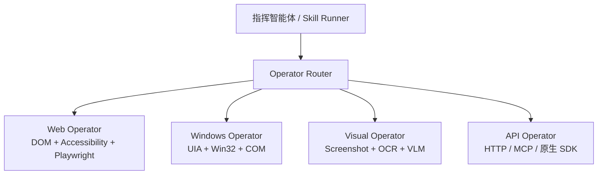

# GUI 智能体与演示学习开源项目调研

## 1. 调研目的

CommandCenter 的核心目标是：

> 员工演示一次或几次跨系统工作，中控将操作编译为可审核、可测试、可复用的 Skill；以后员工只需用自然语言发起任务，中控便可操作多个业务系统完成工作。

目标系统可能是 Web MES、ERP、WMS、OA，也可能是 Windows 客户端、远程桌面或 Citrix 应用，并不保证提供 API。因此，本次调研不只比较“浏览器能不能自动点击”，而是重点研究：

1. 系统如何读取页面或桌面信息。
2. 如何记录员工演示。
3. 如何把演示转换为可重复执行的表示。
4. 正常执行时是否每一步都依赖大模型。
5. 页面发生变化时如何重新定位和修复。
6. 如何验证操作确实成功。
7. 如何跨 Web、桌面和纯像素环境扩展。
8. 哪些设计值得 CommandCenter V1 借鉴。

调研对象：

- OpenAdapt
- Anthropic Computer Use / Teach Mode
- Stagehand
- Skyvern
- Microsoft UFO² / UFO³
- UI-TARS Desktop
- Playwright
- browser-use（补充参考）

调研日期为 2026-07-27，内容依据各项目官方文档和官方 GitHub 仓库整理。

---

## 2. 先给结论

### 2.1 行业方案正在形成三层结构

这些项目虽然定位不同，但基本可以归纳成三层：

```text
指挥与规划层
  理解任务、拆解步骤、选择系统和执行器

Skill / Workflow 层
  保存步骤、参数、条件、验证规则、错误处理和版本

Operator 层
  使用 DOM、无障碍树、Windows UIA、原生 API、截图和鼠标键盘执行
```

不同项目主要是在三层中的重心不同：

- OpenAdapt 重点研究“演示如何编译为可重复程序”。
- Anthropic Teach Mode 重点研究“演示如何成为模型执行时的上下文”。
- Stagehand 和 Skyvern 重点研究“AI 如何增强浏览器自动化”。
- UFO 重点研究“如何深度接入 Windows，并跨应用编排”。
- UI-TARS 重点研究“仅通过截图和通用输入设备操作任意 GUI”。
- Playwright 提供稳定、确定性的 Web 执行底座。

### 2.2 最可靠的路线不是纯视觉，也不是纯脚本

各项目共同指向一种混合执行策略：

```text
结构化信息和确定性执行
  → DOM / Accessibility / UIA / 原生 API

结构化方式失败
  → OCR / 模板匹配 / 视觉模型重新定位

仍然无法确认
  → 停止并请求人工处理
```

纯坐标录制很脆弱；每一步都调用视觉大模型则速度慢、成本高，并且难以预测。生产方案倾向于：

1. 首次探索或界面变化时使用 AI。
2. 把已经识别的操作缓存或编译。
3. 健康路径使用确定性重放。
4. 只在定位失败时调用 AI 修复。
5. 每个关键步骤执行后验证结果。

### 2.3 演示不是 Skill，必须经过“编译”

一次演示提供的是证据：

```text
动作 + 页面状态 + 控件信息 + 截图 + 前后变化
```

Skill 则是经过抽象的能力：

```text
目标 + 输入参数 + 有序步骤 + 变量映射
+ 前置条件 + 成功条件 + 错误处理 + 权限 + 版本
```

因此，“录下来”与“学会了”之间还需要：

- 去除无关动作。
- 把演示数据替换为参数。
- 识别跨系统数据传递。
- 生成稳定的控件定位证据。
- 推导步骤前置条件和后置条件。
- 在新数据和新页面状态上测试。
- 人工审核后发布固定版本。

---

## 3. 项目总览

| 项目 | 主要定位 | 主要感知方式 | 正常执行方式 | 演示学习 | 最值得借鉴 |
|---|---|---|---|---|---|
| OpenAdapt | 演示编译与 GUI 自动化 | 截图、OCR、模板、几何、可访问性信息 | 编译后的确定性重放 | 强 | Record → Compile → Replay、验证失败即停止 |
| Anthropic Teach Mode | 演示条件化的 Computer Use | 截图、动作、可选语音 | 模型参考演示并适应当前界面 | 强 | 示范是上下文，不是绝对坐标宏 |
| Stagehand | AI 增强的浏览器 SDK | DOM、Accessibility、LLM | 缓存动作或 Playwright 执行，失败时自愈 | 弱 | AI 探索一次，之后缓存确定性动作 |
| Skyvern | 视觉 LLM 浏览器工作流 | 页面结构、截图、视觉模型 | Task / Workflow 块驱动浏览器 | 弱 | 自然语言动作、提取、验证和工作流块 |
| Microsoft UFO | Windows AgentOS 与跨设备编排 | UIA、Win32、WinCOM、截图、视觉 | 原生 API 优先，GUI 兜底 | 中 | HostAgent/AppAgent、混合检测、统一命令层 |
| UI-TARS Desktop | 通用视觉 GUI Agent | 截图和视觉语言模型 | 模型输出坐标动作，Operator 执行 | 弱 | 跨平台纯像素兜底和统一 Operator 接口 |
| Playwright | Web 自动化基础设施 | DOM、角色、标签、Accessibility | 确定性浏览器动作 | 代码录制，不负责 Skill 学习 | Locator、自动等待、Trace、ARIA Snapshot |
| browser-use | 自然语言 Web Agent | DOM、页面状态、浏览器控制 | Agent 循环调用浏览器动作 | 弱 | 快速构建自然语言浏览器智能体 |

这里的“演示学习”指员工做一次后系统能直接利用演示，不等同于项目是否支持普通工作流编辑或脚本录制。

---

## 4. OpenAdapt：最接近“员工演示生成 Skill”

### 4.1 项目定位

[OpenAdapt](https://github.com/OpenAdaptAI/OpenAdapt) 将自己定位为开源的 Generative Process Automation。其最新文档进一步把系统定义为一个 [demonstration compiler](https://docs.openadapt.ai/)：

> 给系统展示一次重复性 GUI 工作，系统把演示编译成受治理、可确定性重放的程序。

它覆盖浏览器、Windows、macOS、Linux、RDP、Citrix 和其他虚拟桌面环境。这一点与 CommandCenter 面向“接口条件不同的多类企业系统”非常接近。

### 4.2 核心流水线

OpenAdapt 的总体过程是：

```text
Demonstrate
  采集员工动作、截图、可访问性信息

Learn / Compile
  整理演示、抽象目标、建立定位证据、形成可执行包

Execute
  观察当前状态、定位目标、执行动作、验证结果
```

其生态被拆成多个子模块：

| 模块 | 作用 |
|---|---|
| `openadapt-capture` | 录制用户事件和环境状态 |
| `openadapt-ml` | 模型训练、推理和 GUI 策略 |
| `openadapt-grounding` | 将操作意图定位到具体 UI 元素 |
| `openadapt-retrieval` | 检索相关演示 |
| `openadapt-evals` | 评测自动化成功率 |
| `openadapt-viewer` | 查看和审核演示 |
| `openadapt-privacy` | 对采集内容做隐私处理 |

这说明一个成熟的“演示生成能力”并不是单个 Recorder，而是采集、存储、查看、隐私、编译、定位、评测组成的一套链路。

### 4.3 编译后的步骤如何重新找到目标

[OpenAdapt 的演示编译器文档](https://docs.openadapt.ai/concepts/demonstration-compiler/)强调，编译结果不能只保存鼠标坐标。每个步骤携带多种冗余证据：

- 目标控件的局部截图模板。
- 从目标附近读取的 OCR 文本。
- 相对稳定锚点的几何关系。
- 演示中该动作导致的页面变化，即后置条件。

重放时按照定位阶梯逐级尝试：

```text
本地模板或结构化证据
  → OCR 与几何锚点
  → 明确配置的模型修复
  → 无法验证则停止
```

这比“把完整截图发给大模型，让它每次重新决定”更适合高频企业流程。

### 4.4 健康路径不调用模型

OpenAdapt 当前设计中最值得注意的一点是：

> 正常界面没有变化时，编译后的流程可以不调用模型；只有界面漂移、确定性定位失败时，才允许配置的模型提出修复方案。

这样可以降低：

- 单步延迟。
- 模型调用成本。
- 相同输入得到不同动作的概率。
- 敏感页面反复发送到外部模型的风险。

### 4.5 验证与治理

OpenAdapt 强调三点：

1. **Effect verification**：不能因为屏幕显示“保存成功”就假定数据库真的写入成功；条件允许时，还应使用系统记录、REST API 或其他事实来源验证。
2. **Identity gate**：无法确认当前业务对象身份时拒绝操作，避免把内容写到错误客户或错误工单。
3. **Halt, don't guess**：无法确认后停止，而不是猜一个按钮继续点击。

### 4.6 对 CommandCenter 的直接启示

建议吸收：

- 把模块命名和职责明确区分为 `Record → Compile → Replay`。
- 每个 UI 步骤保存多种定位证据，不保存单一选择器。
- 每个写操作都必须有后置条件。
- 健康路径尽量不调用模型，模型只负责首次编译和失败修复。
- 演示查看器和运行报告属于 V1 主链路，不是外围功能。
- 录制数据要从第一天考虑脱敏和审计。

不应直接照搬：

- CommandCenter 的 Skill 还需要跨系统数据映射、业务权限、版本发布和自然语言任务匹配，范围比单个 GUI 重放包更大。
- OpenAdapt 的最新“确定性演示编译”方向仍需要用真实 MES 页面验证稳定性，不能只依据项目描述判断生产成熟度。

建议后续优先阅读代码：

- [`OpenAdaptAI/OpenAdapt`](https://github.com/OpenAdaptAI/OpenAdapt)
- [`OpenAdaptAI/openadapt-capture`](https://github.com/OpenAdaptAI/openadapt-capture)
- [`OpenAdaptAI/openadapt-grounding`](https://github.com/OpenAdaptAI/openadapt-grounding)
- [`OpenAdaptAI/openadapt-evals`](https://github.com/OpenAdaptAI/openadapt-evals)

---

## 5. Anthropic Teach Mode：把演示作为可适应的执行规范

### 5.1 核心做法

Anthropic 在 [Computer Use 与 Browser Use 最佳实践](https://claude.com/blog/best-practices-for-computer-and-browser-use-with-claude)中介绍了内部称为 Teach Mode 的模式：

1. 用户亲自完成一次任务。
2. 系统在每一步记录截图、动作和可选语音讲解。
3. 执行相同任务时，把完整演示作为模型上下文。
4. 模型参考演示，但根据当前界面重新判断等价控件。

关键点是：

> 回放不是严格复制历史坐标，而是让模型把演示当作行为规范。

如果按钮移动或菜单结构发生小改动，模型仍可以寻找语义上等价的目标。

### 5.2 为什么比纯提示词更有效

员工往往能熟练完成工作，却很难把所有隐含判断写成详细提示词。演示直接提供：

- 操作顺序。
- 用户关注的页面区域。
- 实际字段和值之间的关系。
- 中间等待和确认状态。
- 出现某个界面时采用的动作。

这就是“show, don't tell”。

### 5.3 局限

如果每次执行都把完整演示和当前截图交给模型逐步推理，会带来：

- 延迟较高。
- Token 与模型调用成本较高。
- 执行仍有非确定性。
- 截图中的敏感信息需要额外治理。
- 网页中的恶意提示可能形成 Prompt Injection。

Anthropic 官方也特别强调 Computer Use 会接触不可信网页和图像，必须考虑提示注入分类、权限边界和高风险操作确认。

### 5.4 对 CommandCenter 的启示

Teach Mode 更适合作为两种能力：

1. **首次 Skill 编译的证据来源**：让模型从演示理解业务意图。
2. **确定性执行失败后的修复上下文**：把原演示和当前状态交给模型寻找等价路径。

不建议把它作为所有已发布 Skill 的唯一执行方式。CommandCenter 应进一步将演示编译成结构化 Skill，健康路径确定性执行。

---

## 6. Stagehand：AI 探索一次，缓存后重复执行

### 6.1 项目定位

[Stagehand](https://github.com/browserbase/stagehand) 是浏览器 Agent SDK，试图结合：

- 代码的精确性。
- 自然语言的灵活性。
- Playwright 浏览器控制能力。

它不是员工演示录制器，但非常适合参考 CommandCenter 的 Web Operator。

### 6.2 核心操作

Stagehand 提供的高层能力包括：

| 能力 | 作用 |
|---|---|
| `act` | 根据自然语言或已经解析的动作操作页面 |
| `observe` | 观察页面并返回候选动作 |
| `extract` | 按结构化 Schema 提取页面数据 |
| `agent` | 执行多步骤浏览器任务 |

典型思路是：

```text
自然语言描述动作
  → AI 根据当前页面解析成可执行动作
  → 执行动作
  → 将解析结果缓存
  → 后续直接使用缓存动作
```

### 6.3 缓存与自愈

[Stagehand 动作缓存文档](https://docs.stagehand.dev/v2/best-practices/caching)给出的模式是：

1. 第一次用 `observe` 把自然语言解析成动作。
2. 保存该动作。
3. 后续直接把缓存动作交给 `act`，不调用模型。
4. 缓存动作失败时，可以开启 self-heal，重新用自然语言让 AI 解析。

这与 OpenAdapt 的“健康路径确定性执行，失败时模型修复”高度一致，只是 Stagehand 的对象是 Web 页面动作。

### 6.4 对 CommandCenter 的启示

Web Operator 可以采用类似策略：

```text
Skill Step 中的业务目标
  + 已缓存的 Locator 候选
  + 页面指纹
  → Playwright 直接执行

直接执行失败
  → AI 基于当前 DOM / Accessibility / 截图重新定位
  → 验证成功
  → 形成待审核的 Locator 修订
```

需要注意：自愈结果不应静默修改已发布 Skill。修复可以用于本次运行，但持久化为新版本前必须审核和回归测试。

许可证：Stagehand 官方仓库使用 MIT License。

---

## 7. Skyvern：视觉 LLM 与工作流块结合

### 7.1 项目定位

[Skyvern](https://github.com/Skyvern-AI/skyvern) 使用 Playwright、LLM 和计算机视觉自动化浏览器流程。它尽量避免只依赖固定 XPath，并允许模型根据网页内容完成以前没有写过专用脚本的网站任务。

### 7.2 核心抽象

Skyvern 有两个主要层级：

- **Task**：一次网站目标，包含 URL、Prompt、可选输出 Schema 和错误条件。
- **Workflow**：将多个 Task 和功能块组合成完整流程。

工作流块包括：

- Browser Task / Browser Action
- Data Extraction
- Validation
- Loop
- File Parse / Download / Upload
- HTTP Request
- Text Prompt
- Email
- Custom Code
- Wait

其 SDK 也提供接近统一 Operator 的接口：

```text
act       执行动作
extract   提取结构化信息
validate  验证页面状态
prompt    对页面做模型判断
```

### 7.3 优点

- 对陌生网站和变化页面的适应能力较强。
- 自然语言动作与普通 Playwright 动作可以混用。
- 提取和验证被设计为一等能力，而不只是点击。
- 工作流可以混合浏览器、HTTP、文件和代码步骤。
- 有可视化 Workflow Builder，适合研究 IT 管理员审核体验。

### 7.4 局限

- 不是以“员工演示编译”为主要产品路径。
- 视觉和模型驱动步骤比确定性执行更慢。
- 对企业内部固定流程，每次重新推理可能没有必要。
- 项目核心仓库采用 AGPL-3.0，闭源商业产品如果直接集成或修改部署，需要专门进行许可证评估。

### 7.5 对 CommandCenter 的启示

建议借鉴：

- `act / extract / validate` 三类能力分离。
- Workflow 中同时容纳浏览器、HTTP、文件、模型和验证步骤。
- 每个任务可以声明错误条件。
- 管理端使用结构化 Workflow Block 展示 Skill。

CommandCenter 不应把 Skyvern 式自由浏览器 Agent 直接当成全部 Skill 执行器，而应将它作为未知页面探索或确定性步骤失败时的 Web Visual Operator。

---

## 8. Microsoft UFO：Windows 深度集成与分层指挥

### 8.1 项目定位

[Microsoft UFO](https://github.com/microsoft/UFO) 从 Windows UI 智能体发展为 UFO² Desktop AgentOS 和 UFO³ Galaxy。其[官方架构文档](https://microsoft.github.io/UFO/)与 CommandCenter 的长期目标非常接近：

- UFO² 负责单台 Windows 设备上的跨应用执行。
- UFO³ Galaxy 负责多设备、跨平台任务编排。

### 8.2 HostAgent 与 AppAgent

UFO² 使用两层智能体：

| 角色 | 职责 |
|---|---|
| HostAgent | 拆解桌面任务、选择应用、协调应用间顺序 |
| AppAgent | 在某个具体应用内识别控件并完成操作 |

可概括为：

```text
HostAgent 决定 WHAT 和 WHEN
AppAgent 决定 HOW 和 WHERE
```

两者通过共享状态和明确状态机协作。这个边界很适合 CommandCenter：

- 指挥中心负责任务、系统和 Skill 层面的编排。
- 每类 Operator 或系统 Agent 负责应用内部执行。

### 8.3 混合控件识别

[UFO² Overview](https://github.com/microsoft/UFO/blob/main/documents/docs/ufo2/overview.md)描述了多层 Windows 感知：

- Windows UI Automation：读取标准控件和无障碍树。
- Win32：窗口、进程和底层控制。
- WinCOM：直接操作 Office 等支持 COM 的应用。
- 视觉识别：补充自绘控件和 UIA 无法识别的区域。

这说明 Windows 自动化的“更好办法”不是直接上纯截图模型，而是先读取操作系统提供的控件结构。

### 8.4 统一 GUI–API 动作层

UFO² 在能够使用应用原生能力时优先使用 API，在不支持时退回 GUI。例如 Office 可以通过专用库或 COM 操作，普通界面则使用 click、type、select、scroll。

它还通过 MCP Server 暴露统一命令，例如：

```text
capture_screenshot
get_ui_tree
get_control_info
click
set_edit_text
select_control_by_name
launch_application
close_application
```

### 8.5 性能和隔离思路

UFO² 还提供两个值得关注的方向：

- **多动作推测执行**：模型一次预测多个机械动作，每一步用轻量状态检查确认，减少模型往返。
- **Picture-in-Picture Desktop**：让 Agent 在隔离的 Windows 桌面中运行，避免与员工争抢鼠标键盘。

企业部署时，隔离桌面或专用执行机非常重要，否则普通桌面自动化会影响员工当前工作。

### 8.6 对 CommandCenter 的启示

建议吸收：

- 中控 Agent 与应用执行 Agent 分层。
- Windows Operator 优先 UIA / Win32 / COM，视觉只补盲。
- 所有底层能力通过统一命令接口暴露。
- Operator 运行在隔离桌面或专用执行环境中。
- 使用显式状态机和逐步结果报告，不让 Agent 隐式长时间运行。

许可证：UFO 官方仓库使用 MIT License。

---

## 9. UI-TARS Desktop：纯像素环境的通用兜底

### 9.1 项目定位

[UI-TARS Desktop](https://github.com/bytedance/UI-TARS-desktop) 是基于视觉语言模型的通用 GUI Agent，支持 Windows、macOS 和浏览器。它适合没有 DOM、没有 UIA 或无法接入系统内部结构的环境。

### 9.2 执行循环

[UI-TARS SDK](https://github.com/bytedance/UI-TARS-desktop/blob/main/docs/sdk.md)把核心拆成：

```text
GUIAgent
  调用模型，根据截图和任务产生动作

Operator
  提供 screenshot() 和 execute()

具体 Operator
  Web Operator / NutJS Desktop Operator / Mobile Operator
```

典型循环：

```text
Operator 截图
  → 模型读取任务、历史截图和动作空间
  → 模型输出 click / type / scroll 等坐标动作
  → Operator 执行
  → 再次截图
  → 继续直到完成或中止
```

桌面 Operator 支持：

- 单击、双击、右键和拖动。
- 键盘输入和快捷键。
- 滚动。
- 截图。

### 9.3 优点

- 不依赖业务系统提供接口。
- 不依赖网页 DOM。
- 可以覆盖自绘控件、远程桌面和视觉可见但结构不可读的系统。
- Operator 接口简单，便于替换底层设备。
- Apache-2.0 许可证相对宽松。

### 9.4 局限

- 坐标和视觉定位受分辨率、缩放、窗口位置影响。
- 每一步截图推理延迟较高。
- 对相似按钮、密集表格、弹窗遮挡容易误操作。
- 很难仅凭屏幕确认后台数据是否真正写入。
- 员工与 Agent 共用桌面时会争抢焦点、鼠标和键盘。

### 9.5 对 CommandCenter 的启示

UI-TARS 类型的纯视觉能力应当是最后一级通用兜底，而不是 V1 主执行方式：

```text
Web：DOM / Accessibility / Playwright
Windows：UIA / Win32 / COM
远程或自绘界面：截图 / OCR / UI-TARS 类视觉模型
```

CommandCenter 的 Operator 接口可以借鉴 `screenshot + execute` 的最小抽象，但上层仍应增加 `read / find / verify` 等语义动作。

---

## 10. Playwright：Web Operator 的确定性底座

### 10.1 它解决什么

[Playwright](https://playwright.dev/)本身不是智能体，也不会把员工演示自动变成业务 Skill。它解决的是浏览器执行的稳定性和可观测性。

### 10.2 稳定定位

[Playwright Locator](https://playwright.dev/docs/locators)推荐优先使用用户可感知的语义定位：

- Role + Accessible Name
- Label
- Text
- Placeholder
- Test ID

例如“角色为按钮、名称为提交”通常比绝对 XPath 或坐标更稳定。

### 10.3 自动等待

[Auto-waiting](https://playwright.dev/docs/actionability)会在点击前检查：

- 元素唯一。
- 可见。
- 稳定。
- 能接收事件。
- 已启用。

这避免录制脚本中充斥固定 `sleep`，也降低页面加载速度差异导致的失败。

### 10.4 Trace 与 Accessibility Snapshot

[Trace Viewer](https://playwright.dev/docs/trace-viewer-intro)能够回看每个动作、页面快照和网络请求，适合作为 Skill 录制和失败审计的基础证据。

[ARIA Snapshot](https://playwright.dev/docs/aria-snapshots)可以保存页面或局部控件的无障碍树，包括角色、名称、状态和层级。它很适合：

- 给模型提供比完整 DOM 更紧凑的页面表示。
- 记录动作前后的语义页面状态。
- 建立步骤后置条件。
- 判断页面结构是否发生关键变化。

### 10.5 对 CommandCenter 的启示

第一版 Web Recorder / Operator 建议直接基于 Playwright：

- 使用受控 Chromium 保持录制和回放环境一致。
- 录制时保存 Locator 候选、ARIA Snapshot、URL、局部截图和动作前后状态。
- 执行时使用 Locator 和自动等待。
- 失败时输出 Playwright Trace。
- AI 视觉仅在语义 Locator 无法定位时参与。

---

## 11. browser-use：快速验证自然语言浏览器 Agent

[browser-use](https://github.com/browser-use/browser-use)提供自然语言驱动的浏览器 Agent，底层使用浏览器自动化能力，并支持限制允许访问的域名等运行配置。

它适合：

- 快速验证“员工一句话，Agent 自己浏览页面完成任务”。
- 研究 Agent 循环、浏览器工具和会话管理。
- 作为未知页面探索能力的参考。

它不是专门的演示编译器，也不能替代 CommandCenter 的 Skill 版本、数据映射、权限和审核机制。因此，适合作为实验性 Agent Runner 参考，而不是 V1 业务 Skill 的事实来源。

---

## 12. 各项目实际采用的五种关键方法

### 12.1 方法一：结构优先的界面读取

```text
Web
  DOM + Accessibility Tree + Locator

Windows
  UI Automation + Win32 + COM

纯像素环境
  Screenshot + OCR + Vision Grounding
```

对应项目：

- Playwright：DOM / Accessibility。
- Stagehand：DOM / Accessibility + AI。
- UFO：UIA / Win32 / COM + 视觉。
- UI-TARS：截图 + 视觉。

### 12.2 方法二：定位证据不是单值

一个可靠的目标元素描述不应只有：

```json
{"x": 523, "y": 317}
```

而应该类似：

```json
{
  "intent": "提交采购申请",
  "role": "button",
  "accessible_name": "提交",
  "text": "提交",
  "test_id": "submit-request",
  "dom_fingerprint": "...",
  "nearby_anchor": "采购申请",
  "template_image_ref": "...",
  "recorded_box": [480, 290, 90, 40]
}
```

执行时从最稳定、最低成本的证据开始匹配。

### 12.3 方法三：确定性健康路径，AI 修复路径

OpenAdapt 与 Stagehand 都采用类似思想：

```text
首次：
  演示或自然语言
  → AI / 编译器理解
  → 保存可执行表示

以后：
  直接执行保存的表示

页面变化：
  AI 重新定位或提出修复
  → 验证
  → 形成待审核更新
```

### 12.4 方法四：动作后必须观察效果

不能把 `click()` 没报错当作业务成功。

至少需要三类验证：

1. **界面后置条件**：出现成功提示、状态变为“采购中”。
2. **对象身份条件**：仍然在正确工单、正确员工、正确采购申请上。
3. **事实来源条件**：条件允许时，通过查询 API、系统记录或第二页面确认真实写入。

### 12.5 方法五：指挥层与执行层分开

UFO 的 HostAgent / AppAgent 说明，跨系统指挥和应用内部操作不应由同一个自由 Agent 混在一起完成：

```text
CommandCenter Orchestrator
  选择 Skill、安排系统顺序、传递业务数据

Web / Windows / Visual Operator
  在指定系统内完成有限动作

Verifier
  判断步骤和整体业务结果
```

---

## 13. 对 CommandCenter 的推荐架构

### 13.1 统一的混合 Operator



给上层 Skill 暴露统一语义动作：

```text
observe
open
find
read
click
fill
select
wait_for
verify
```

底层根据系统能力选择具体实现。

### 13.2 系统接入时声明能力，而不是固定一种权限

每个 `SystemDefinition` 可以描述：

```yaml
execution_modes:
  - api
  - web_dom
  - windows_uia
  - visual

preferred_order:
  - api
  - web_dom
  - visual

permissions:
  readable_scopes: []
  writable_scopes: []
  requires_human_confirmation: []
```

这样可以满足“不同权限、不同系统采用不同方案”，而不把执行技术写死在 Skill 业务含义里。

### 13.3 UI 步骤的定位阶梯

建议 V1 的 Web Operator 使用：

```text
1. 专门配置的稳定业务标识 / test-id
2. Role + Accessible Name
3. Label / Text / Placeholder
4. DOM 特征与附近锚点
5. 局部截图模板 + OCR
6. 视觉模型重新定位
7. 停止并请求人工处理
```

每一级都要记录使用了哪种证据和置信度。

### 13.4 Skill 编译结果

演示编译后的 UI 步骤可以包含：

```yaml
- id: submit_purchase_request
  system: purchase_system
  action: click
  target:
    intent: 提交采购申请
    role: button
    accessible_name: 提交
    fallback_text: 提交
    template_ref: artifacts/submit-button.png
  preconditions:
    - current_page == purchase_request_create
    - form_validation_errors == 0
  postconditions:
    - success_banner_visible == true
    - purchase_request_id is not empty
  repair_policy:
    allow_ai_relocation: true
    persist_repair: draft_new_version
  failure_policy:
    on_unverified: halt
```

这里的关键不是 YAML 格式，而是每个步骤同时携带目标、证据、前置条件、后置条件和修复边界。

---

## 14. V1 应该验证什么

建议 V1 不再只验证“页面演示后转成 API 调用”，而是至少包含一条真正的纯 UI 路径。

### 14.1 建议实验

在当前两个测试 Web 系统中设计同一条跨系统流程：

```text
系统 A 读取库存不足任务
  → 系统 B 创建采购申请
  → 获取采购单号
  → 回到系统 A 回写采购单号和状态
```

执行模式：

| 步骤 | 建议方式 |
|---|---|
| 系统 A 读取任务 | Web DOM |
| 系统 B 创建申请 | Web DOM |
| 读取采购单号 | Web DOM |
| 系统 A 回写 | Web DOM |
| 最终真实性验证 | 测试系统 API 或数据库只读校验 |

这样可以证明：

- 没有业务写 API 时仍能完成工作。
- 操作结果不是只靠页面提示判断。
- 同一 Skill 能跨两个页面系统传递数据。

### 14.2 建议对照实验

同一个 Skill 可以运行三种策略：

1. 完全确定性的 Playwright Skill。
2. Playwright 为主、定位失败时 AI 自愈。
3. 纯视觉 Agent。

比较：

- 成功率。
- 平均耗时。
- 模型调用次数。
- 页面轻微变化后的恢复率。
- 错误操作率。
- 运行证据完整度。

这能帮助我们基于数据决定视觉模型在 CommandCenter 中应占多大比例。

---

## 15. 哪些内容现在不建议直接采用

### 15.1 不采用纯坐标宏

原因：

- 分辨率和缩放改变即失效。
- 窗口移动或列表插入一行就可能点错对象。
- 无法表达业务语义和成功条件。

### 15.2 不采用每一步都由模型自由规划

原因：

- 慢且成本高。
- 难以复现和测试。
- 同一任务可能得到不同操作路径。
- 企业权限和审计边界难以固定。

### 15.3 不让“自愈”静默修改已发布 Skill

AI 修复应记录：

- 为什么原定位失败。
- 使用了什么新证据。
- 实际执行了什么动作。
- 后置条件是否通过。

持久化修复应形成草稿新版本，经回归测试和审核后再发布。

### 15.4 不把 API 当作唯一最终形态

API 仍然是最优执行方式之一，但现实中的 MES 和遗留系统可能：

- 没有 API。
- 只开放读取接口。
- API 权限与员工页面权限不一致。
- 必须通过已有业务界面完成合规操作。

因此，API 应是 Operator 的一种实现，而不是 Skill 的前提。

---

## 16. 推荐的下一步阅读和原型顺序

### 第一优先级：直接影响 V1

1. OpenAdapt demonstration compiler：理解录制、编译、定位证据和验证。
2. Playwright Locator / Trace / ARIA Snapshot：建立 Web 录制与执行底座。
3. Stagehand caching / self-heal：验证 AI 解析一次、缓存复用。

### 第二优先级：影响以后扩展

4. UFO²：研究 Windows UIA、HostAgent/AppAgent 和混合命令层。
5. UI-TARS SDK：研究纯像素 Operator 和视觉动作协议。

### 第三优先级：探索自由 Agent

6. Skyvern：研究 Workflow Block、提取和验证。
7. browser-use：研究自然语言浏览器 Agent 循环。
8. Anthropic Teach Mode：研究演示上下文与失败修复策略。

### 是否立即克隆代码

本轮先不把这些大型仓库放进 CommandCenter，原因是：

- 目前主要任务是比较方法，不是集成某个项目。
- 多个仓库依赖庞大，直接放进项目会污染版本管理。
- Skyvern 等项目还涉及许可证边界。

进入原型验证时，建议在独立目录中浅克隆：

```text
D:\python\gui-agent-references\
  openadapt\
  stagehand\
  ufo\
  ui-tars-desktop\
```

CommandCenter 只保存调研结论、接口适配代码和必要的实验，不复制第三方完整源码。

---

## 17. 当前建议

综合这些项目，CommandCenter 可以将当前混合方案进一步明确为：

> **演示驱动的 Skill 编译器 + 确定性优先的多后端 Operator + AI 修复与验证机制。**

V1 推荐技术路线：

```text
员工在受控 Chromium 中演示
  → Playwright 记录动作、Locator、ARIA、截图和前后状态
  → Skill Compiler 参数化并生成结构化 Skill 草稿
  → 管理员审核
  → 用新业务数据进行真实 UI 重放
  → 每一步验证后置条件
  → 成功后发布固定版本

健康运行：
  Playwright 确定性执行

定位失败：
  DOM / Accessibility 重新解析
  → 局部视觉模型兜底

无法确认对象或结果：
  停止并人工处理
```

未来增加：

- Windows UIA Operator。
- Win32 / COM / 应用专用 Operator。
- Citrix / RDP Visual Operator。
- 隔离桌面和专用执行节点。
- 多次演示对比、变体学习和流程发现。

---

## 18. 与 CommandCenter 现有设计的关系

相关项目文档：

- [企业智能指挥中心平台骨架与 V1 纵向闭环设计](../superpowers/specs/2026-07-23-command-center-platform-skeleton-design.md)
- [企业智能指挥中心同类产品调研](./2026-07-23-enterprise-agent-orchestration-products.md)

相关 Obsidian 笔记：

- [[10-Projects/CommandCenter/核心功能-员工演示生成Skill]]
- [[10-Projects/CommandCenter/设计原则-统一执行者编排模型]]
- [[10-Projects/CommandCenter/功能想法-ProcessDiscovery流程发现]]
- [[10-Projects/CommandCenter/_MOC-CommandCenter]]

本次调研没有废弃六层平台骨架，但对 V1 执行路线提出了更明确的修订方向：

1. 原来的“语义采集后 API 优先执行”仍然适用于有接口且权限允许的系统。
2. UI 自动化不再只是遥远的兜底，而应在 V1 中完成一次真实闭环验证。
3. Skill 不应绑定 API 或浏览器；它描述业务动作，由 Operator Router 选择可用执行方式。
4. AI 的主要职责从“每次自由执行”收敛为“演示理解、Skill 编译、未知页面探索和失败修复”。

这些属于调研建议，尚未替换现有 V1 事实来源。待原型验证和讨论确认后，再正式更新 V1 设计规格。

---

## 19. 官方资料

### OpenAdapt

- [OpenAdapt GitHub](https://github.com/OpenAdaptAI/OpenAdapt)
- [OpenAdapt Documentation](https://docs.openadapt.ai/)
- [The demonstration compiler](https://docs.openadapt.ai/concepts/demonstration-compiler/)
- [OpenAdapt Desktop](https://github.com/OpenAdaptAI/openadapt-desktop)

### Anthropic

- [Best practices for computer and browser use with Claude](https://claude.com/blog/best-practices-for-computer-and-browser-use-with-claude)

### Stagehand

- [Stagehand GitHub](https://github.com/browserbase/stagehand)
- [Caching Actions](https://docs.stagehand.dev/v2/best-practices/caching)

### Skyvern

- [Skyvern GitHub](https://github.com/Skyvern-AI/skyvern)
- [Skyvern Skill / Workflow Blocks](https://github.com/Skyvern-AI/skyvern/blob/main/docs/skill.md)

### Microsoft UFO

- [Microsoft UFO GitHub](https://github.com/microsoft/UFO)
- [UFO Official Documentation](https://microsoft.github.io/UFO/)
- [UFO² Overview](https://github.com/microsoft/UFO/blob/main/documents/docs/ufo2/overview.md)

### UI-TARS

- [UI-TARS Desktop GitHub](https://github.com/bytedance/UI-TARS-desktop)
- [UI-TARS SDK Guide](https://github.com/bytedance/UI-TARS-desktop/blob/main/docs/sdk.md)
- [UI-TARS Model GitHub](https://github.com/bytedance/UI-TARS)

### Playwright

- [Playwright Locators](https://playwright.dev/docs/locators)
- [Playwright Auto-waiting](https://playwright.dev/docs/actionability)
- [Playwright Trace Viewer](https://playwright.dev/docs/trace-viewer-intro)
- [Playwright ARIA Snapshots](https://playwright.dev/docs/aria-snapshots)

### browser-use

- [browser-use GitHub](https://github.com/browser-use/browser-use)

