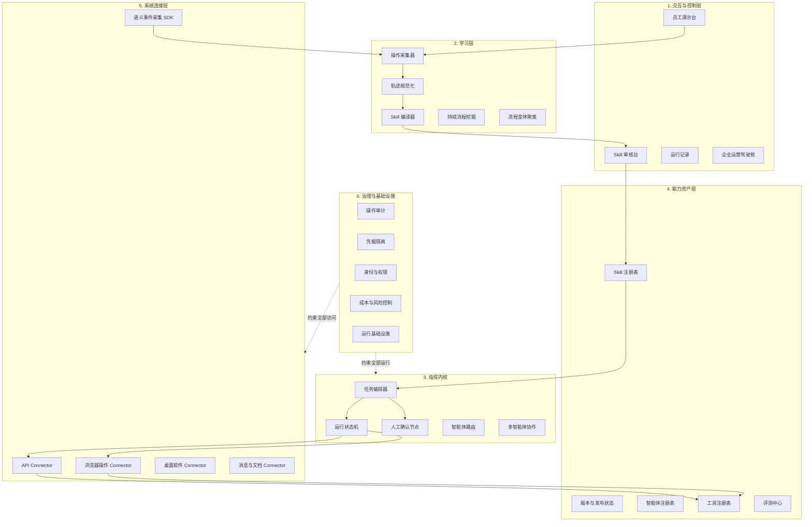
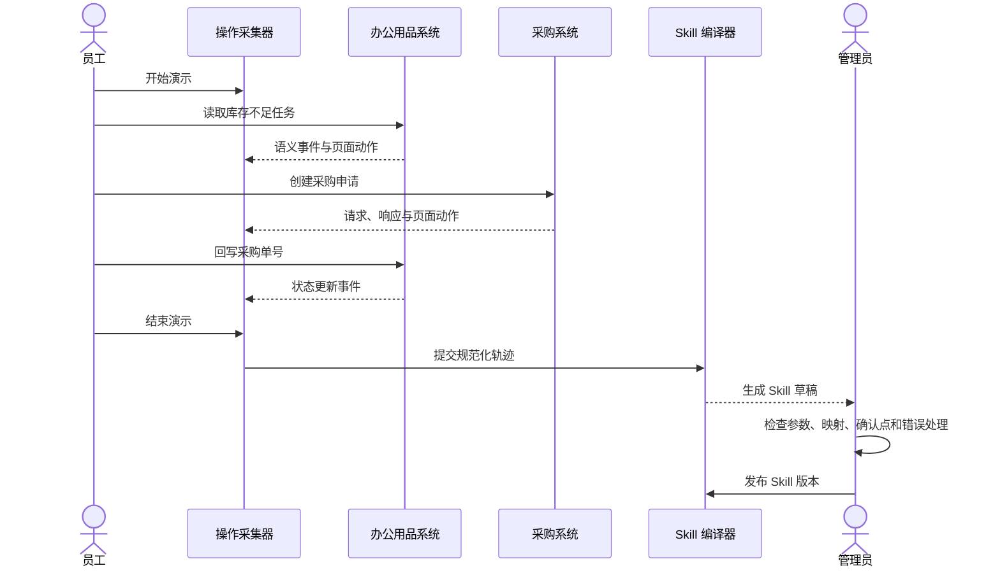
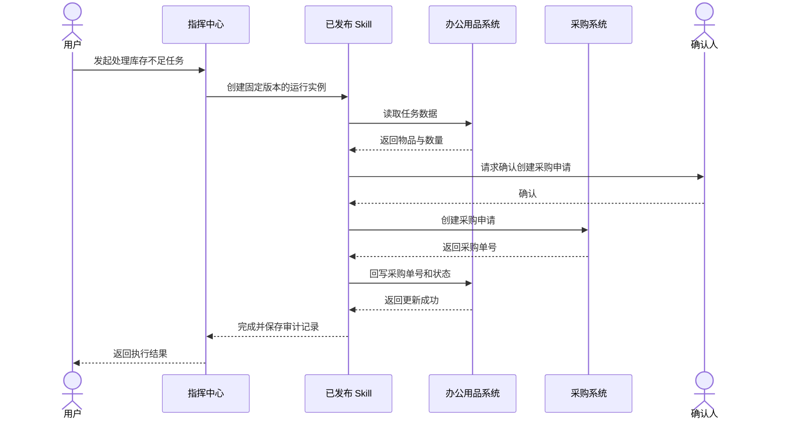

# 企业智能指挥中心平台骨架与 V1 纵向闭环设计

状态：平台长期骨架继续有效；V1 具体实现已由 2026-07-28 独立规格替代
日期：2026-07-23
最近修订：2026-07-24

## 0. 2026-07-24 V1 方案修订说明

本文定义的六层平台骨架、Skill 资产边界、API 优先原则、版本化运行和纵向闭环方向继续有效，不废弃。

但本文原有 V1 细节是在首次讨论阶段形成的，以下内容已被后续讨论替代：

1. 第一版采用“语义事件驱动的示范学习”，不采用纯视觉推断。
2. 两个测试 Web 系统接入轻量操作采集 SDK，主动上报页面动作对应的业务语义和 API Tool。
3. 员工在独立“演示工作台”选择真实任务、填写目标并主动开始或结束录制；普通任务中心不会默认录制。
4. 第一次演示即可生成 Skill 草稿，后续可以追加第二、第三次演示来更新同一个草稿。
5. 员工通过页面完成演示，但发布后的 Skill 尽量通过 API 执行；浏览器操作只作为以后没有 API 时的兜底能力，首条样板 Skill 不强制包含浏览器步骤。
6. 中控界面先按角色拆分为员工工作台和 IT 管理台，不建设账号系统。
7. IT 管理员使用结构化页面审核 Skill 的输入、输出、步骤、Tool、数据映射和成功条件，不直接编辑代码。
8. Skill 必须使用真实测试任务执行并自动验证，通过后才允许发布。
9. 已测试发布的 Skill 在匹配范围内直接自动执行，不设置每次运行前的人工确认。
10. 员工通过自然语言描述任务；中控负责定位业务对象、匹配已发布 Skill 和提取参数。多条业务对象匹配时必须让员工选择。
11. 执行失败时保存已完成步骤；安全读取和具备幂等保证的写入可以受控重试，其他情况停止并交给 IT 管理员恢复。

首条样板流程仍为：

```text
办公用品库存不足任务
  → 创建采购申请
  → 获取采购单号
  → 回写办公用品任务
  → 更新为“采购中”
```

新的 V1 详细规格已经形成：

`docs/superpowers/specs/2026-07-28-command-center-v1-minimal-agent-loop-design.md`

该文档是 V1 实现的事实来源，本文继续作为长期平台骨架参考。

## 1. 文档目的

本文说明 CommandCenter 如何从当前的“配置化表单执行智能体”演进为企业大模型中的智能指挥中心。

文档重点不是一次性列出所有功能，而是解释：

1. 完整平台应该如何分层。
2. 为什么第一版不应同时建设所有平台模块。
3. V1 应该用哪条纵向闭环验证核心价值。
4. 当前代码如何在不推倒重来的前提下演进。
5. 哪些边界需要从第一版开始保持稳定，方便后续增加系统、智能体和 Skill。

## 2. 核心结论

完整指挥中心最终需要同时管理：

- 业务系统
- 系统工具与连接器
- 可复用 Skill
- 各类智能体
- 跨系统任务与流程
- 人工确认节点
- 权限、凭据、审计和运行监控

但 V1 不建设一个“每个模块都有页面、每个模块都只有一点功能”的空平台。

V1 采用纵向闭环优先：

```text
员工演示一条跨系统工作
  → 中控采集并规范化操作轨迹
  → AI 生成可编辑的 Skill 草稿
  → 管理员审核并发布
  → 中控使用 Skill 完成新的同类任务
  → 保存每一步执行结果和审计记录
```

第一版只选择两个测试业务系统和一条真实感足够强的跨系统流程，把上述闭环做完整。

## 3. 为什么选择纵向闭环

### 3.1 没有选择“平台骨架优先”

平台骨架优先会同时创建系统中心、智能体中心、Skill 中心、编排中心、监控中心和权限中心。

这种方式适合展示产品地图，却不能回答最重要的问题：

> 员工演示一次工作后，中控能否真正生成一项可复用能力，并可靠地再次执行？

如果核心学习闭环不可行，外围平台模块做得再完整也没有意义。

### 3.2 没有选择“执行底座优先”

只建设连接器、编排器和运行监控，可以较快得到一个跨系统自动化平台，但它与传统 BPM、RPA 或工作流产品的区别不够明显。

CommandCenter 的产品核心是：

> 企业能力不仅可以被人工配置，还可以从员工示范和长期操作中逐步学习出来。

因此第一版必须包含学习环节，而不是把学习能力推迟到未来。

### 3.3 纵向闭环的价值

纵向闭环能在较小范围内同时验证：

- 操作采集是否包含足够的业务语义。
- AI 能否区分固定规则和每次变化的业务参数。
- Skill 是否能被人读懂、修改和审核。
- 编排器能否跨系统可靠执行。
- API 与界面操作能否组合使用。
- 敏感信息、错误和人工确认能否被正确处理。

这些验证通过后，完整平台只是沿着稳定边界逐层扩展，而不是重新设计。

## 4. 产品定位

CommandCenter 不是单一聊天助手，也不是单一 RPA 录制器。

它是企业能力的学习、管理和执行中枢：

```text
系统接入能力
  + 操作学习能力
  + Skill 资产管理
  + 智能体与工具编排
  + 企业治理
  = 企业智能指挥中心
```

### 4.1 系统

系统是能力的作用对象，例如 OA、ERP、采购、库存、财务、HR、CRM 或企业自研系统。

### 4.2 工具

工具是访问系统的原子能力，例如：

- 查询库存 API
- 创建采购申请 API
- 打开某个业务页面
- 填写并提交表单
- 下载文件
- 发送消息

### 4.3 Skill

Skill 是经过验证、可复用、可版本化的业务能力。

它描述：

- 要完成什么业务目标
- 需要哪些输入
- 满足哪些前置条件
- 按什么顺序调用工具
- 系统之间如何传递数据
- 哪些情况需要判断或人工确认
- 怎样判断成功
- 失败后如何重试、停止或补偿

### 4.4 智能体

智能体负责理解目标、做出有限判断或生成内容。它可以在 Skill 的某个步骤中工作，也可以选择和组合多个 Skill。

智能体不直接绕过权限、连接器和审计访问业务系统。

### 4.5 指挥中心

指挥中心负责决定：

- 使用哪个 Skill 或智能体
- 按什么顺序执行
- 当前运行到了哪一步
- 是否可以继续自动执行
- 何时需要员工确认
- 失败后如何恢复
- 如何保存全过程证据

## 5. 完整平台骨架



六层的目的不是增加抽象，而是隔离变化：

- 页面变化不应改变 Skill 的业务含义。
- 模型变化不应改变业务系统连接方式。
- 新增系统不应修改编排器核心逻辑。
- 新增智能体不应绕过权限与审计。
- Skill 新版本不应改变已经开始运行的历史实例。

## 6. 各层职责

### 6.1 交互与控制层

面向员工、业务管理员和运营人员。

完整平台最终包含：

- 员工演示台
- Skill 草稿审核与测试
- Skill 目录
- 任务发起
- 运行状态与历史
- 异常处理
- 企业能力和运行指标驾驶舱

V1 只实现：

- 开始和结束一次演示
- 查看采集到的步骤
- 查看并修改 Skill 草稿
- 审核发布 Skill
- 发起一次 Skill 运行
- 查看逐步运行记录

### 6.2 学习层

把“人做过一次”转化为“系统以后可以重复做”。

学习层分为三个阶段：

1. 采集：记录发生了什么。
2. 规范化：把不同来源的原始事件整理为统一轨迹。
3. 编译：从轨迹中提取业务目标、变量、步骤、规则和确认点。

V1 使用主动演示，不做后台长期观察。

### 6.3 指挥内核

指挥内核执行已经发布的 Skill，并维护运行状态。

V1 的编排器以确定性流程为主：

- 步骤顺序来自 Skill
- 数据映射来自 Skill
- 是否重试来自 Skill
- 是否需要人工确认来自 Skill
- AI 只在被明确标记为智能判断的步骤中参与

这样可以避免大模型在每次执行时随意重写流程。

### 6.4 能力资产层

把系统可用能力当作企业资产保存。

V1 重点管理：

- Skill 定义
- Skill 版本
- 草稿、已发布、已停用状态
- Skill 使用的工具引用
- Skill 输入和输出定义

后续再增加智能体注册表、工具市场和统一评测中心。

### 6.5 系统连接层

所有业务系统访问都通过连接器完成。

执行策略：

1. 有稳定 API 时优先使用 API。
2. 没有 API、API 能力不足或必须读取界面状态时使用浏览器操作。
3. 后续再扩展 Windows 桌面软件、消息平台和文档工具。

连接器负责技术访问，Skill 负责编排业务意义。两者不能混为一体。

### 6.6 治理与基础设施

治理能力贯穿所有层，不是上线前最后补充的页面。

V1 至少提供：

- 操作人与运行身份
- 凭据引用和隔离
- 敏感字段脱敏
- 关键写操作人工确认
- 逐步审计记录
- Skill 版本固定

完整组织架构、细粒度授权、成本控制和高可用集群留到后续。

## 7. V1 纵向切片

### 7.1 业务样板

V1 使用现有两个测试系统扩展出一条跨系统流程：

```text
办公用品系统出现库存不足的申领任务
  → 员工读取物品、数量、申请人和部门
  → 员工进入采购系统创建采购申请
  → 采购系统返回采购单号
  → 员工回到办公用品系统
  → 回写采购单号并把任务更新为“采购中”
```

选择这条流程的原因：

- 使用当前已有的办公用品与采购测试系统。
- 包含跨系统读取、写入和结果回传。
- 输入和输出清楚，便于判断执行是否成功。
- 可以同时验证 API 与浏览器操作。
- 不需要引入复杂财务或审批规则。

### 7.2 学习闭环



### 7.3 执行闭环



## 8. 操作轨迹设计

单纯保存录屏不足以生成可靠 Skill。

V1 保存混合轨迹：

```text
语义事件
+ API 请求和响应摘要
+ 浏览器页面动作
+ 必要截图
+ 员工可选说明
= Operation Trace
```

### 8.1 TraceStep

每一步至少包含：

- 录制会话 ID
- 步骤序号
- 时间
- 来源系统
- 动作类型
- 业务语义描述
- 页面 URL 或 API 工具引用
- 输入摘要
- 输出摘要
- 页面元素定位信息
- 脱敏后的截图引用
- 与前后步骤的数据关联

### 8.2 采集原则

- 不采集密码、令牌和验证码。
- 对身份证号、手机号等敏感字段进行脱敏。
- 同时保存语义元素和界面定位，不只保存鼠标坐标。
- API 正文默认只保存允许字段或脱敏摘要。
- 测试系统通过语义事件 SDK 主动提供业务含义。
- 所有事件使用同一录制会话 ID 关联。

## 9. Skill 设计

### 9.1 Skill 不是录屏

录屏和操作轨迹只是生成 Skill 的证据。

Skill 是经过抽象后的可执行业务说明：

```yaml
name: create-purchase-for-office-shortage
description: 为办公用品库存不足任务创建采购申请并回写采购单号
inputs:
  task_id:
    type: string
    required: true
outputs:
  purchase_request_id:
    type: string
preconditions:
  - office_task.status == "pending"
  - office_task.reason == "insufficient_stock"
steps:
  - id: load_office_task
    tool: office_system.get_task
  - id: confirm_purchase
    type: human_approval
  - id: create_purchase
    tool: purchase_system.create_request
  - id: update_office_task
    tool: office_system.update_task
success:
  - create_purchase.purchase_request_id is not empty
  - update_office_task.status == "purchasing"
```

以上 YAML 只用于提高文档可读性。

V1 的正式表示采用 Pydantic `SkillSpec`，序列化为 JSON 并保存在 `SkillVersion.spec_json`。所有草稿、测试和执行都读取同一份结构，不同时维护 YAML 与 JSON 两套解释器。

### 9.2 Skill 必须包含

- 唯一标识和说明
- 输入、输出及校验规则
- 前置条件
- 有序步骤
- 工具引用
- 步骤输入映射
- 步骤输出映射
- 分支条件
- 人工确认点
- 成功条件
- 超时和重试规则
- 失败处理
- 发布版本

### 9.3 Skill 不得包含

- 真实密码和令牌
- 演示时使用的固定业务数据
- 只在录制电脑上有效的绝对坐标
- 未经审核的任意代码
- 对业务系统数据库的直接写入

## 10. 核心数据模型

| 实体 | 作用 |
|---|---|
| `SystemDefinition` | 描述一个业务系统及其可用连接方式 |
| `ToolDefinition` | 描述连接器提供的原子能力和输入输出 |
| `RecordingSession` | 一次员工主动演示 |
| `TraceStep` | 演示中的一个规范化步骤 |
| `SkillDefinition` | Skill 的稳定身份和业务说明 |
| `SkillVersion` | 一次可审核、可发布、不可静默修改的版本 |
| `SkillRun` | 使用固定 Skill 版本执行的一次任务 |
| `RunStep` | 运行实例中的步骤状态、输入摘要和输出摘要 |
| `ApprovalTask` | 执行期间等待人工确认的事项 |
| `CredentialReference` | 指向安全凭据，不保存凭据正文 |
| `AuditEvent` | 记录谁在何时对什么对象执行了什么动作 |

### 10.1 版本原则

正在运行的 `SkillRun` 必须固定到具体 `SkillVersion`。

发布新版本不能改变：

- 已完成运行的历史解释
- 正在执行的步骤定义
- 历史审计记录

## 11. 运行状态机

`SkillRun` 使用以下状态：

```text
created
  → running
  → waiting_approval
  → running
  → succeeded

running
  → failed

waiting_approval
  → cancelled
```

`RunStep` 使用：

```text
pending
running
waiting_approval
succeeded
failed
skipped
```

V1 不实现复杂的自动回滚状态。外部系统写操作可能不可逆，因此发生失败时：

1. 保存已经成功的步骤。
2. 停止后续危险写操作。
3. 提供明确的人工处理建议。
4. 修复后从安全步骤继续或重新创建运行。

## 12. 执行可靠性

### 12.1 API 优先

当系统提供稳定 API 时，Skill 使用 API Connector。

原因：

- 输入输出更明确
- 更容易测试
- 更容易实现幂等
- 不受页面布局影响
- 更适合审计

### 12.2 浏览器操作兜底

以下情况使用浏览器 Connector：

- 系统没有相应 API
- API 不返回员工在页面上才能看到的信息
- 操作必须通过已有页面完成
- 第一版需要验证从界面演示到再次执行的能力

浏览器步骤保存语义元素、文本和定位信息，坐标只作为最后回退。

### 12.3 幂等

所有可重复提交的写操作应携带业务幂等键。

例如创建采购申请时使用：

```text
office_task_id + skill_version + operation_name
```

同一业务任务重试时，连接器应优先返回已有结果，不重复创建采购单。

### 12.4 重试

- 读取操作可以有限重试。
- 明确支持幂等的写操作可以有限重试。
- 不确定是否成功的写操作不得自动重复提交。
- 登录失效、权限不足和业务校验失败直接进入人工处理。

## 13. V1 页面

在现有 Vue 前端中增加四个入口：

### 13.1 演示录制

- 选择样板流程
- 开始录制
- 查看当前采集步骤
- 结束录制

### 13.2 Skill 草稿

- 查看 AI 生成的业务说明
- 查看输入输出
- 查看步骤和数据映射
- 设置人工确认点
- 保存草稿
- 测试
- 发布

### 13.3 Skill 目录

- 查看已发布 Skill
- 查看版本
- 停用 Skill
- 发起运行

### 13.4 运行记录

- 查看运行状态
- 查看当前步骤
- 处理人工确认
- 查看失败原因
- 查看逐步审计记录

现有任务中心、外部系统页面和 AI 配置页面继续保留。

## 14. 与当前代码的关系

当前项目已经具备：

- FastAPI 后端
- Vue 3 前端
- Pydantic 配置模型
- LangGraph 表单执行流程
- HTTPX 外部系统调用
- 两个独立测试业务系统
- 动态表单和 AI 配置生成
- 任务中心和运行测试

因此 V1 是演进，不是重写。

### 14.1 建议模块边界

```text
app/
  recording/       演示会话、轨迹采集和规范化
  skills/          Skill 定义、版本、草稿和发布
  orchestration/   Skill 运行、步骤状态和人工确认
  connectors/      API、浏览器及后续连接器
  governance/      审计、脱敏、凭据引用和基础权限
```

### 14.2 现有模块处理

- `app/forms/`：保留，作为表单类工具和配置资产。
- `app/ai_config/`：保留，后续抽取共用的结构化生成能力。
- `app/agent/`：逐步从单一表单图演进为可执行 Skill 图。
- `app/adapters/`：逐步迁移为统一 Connector 接口。
- `external_systems/`：扩展为 V1 跨系统样板环境。
- `frontend/`：继续作为唯一正式前端。

### 14.3 存储

V1 使用 SQLAlchemy 和 SQLite 保存：

- 录制会话
- 轨迹步骤
- Skill 和版本
- 运行实例与步骤
- 人工确认任务
- 审计事件

现有 JSON 表单模板暂不强制迁移，避免无关重构。

LangGraph 负责把已验证的 `SkillSpec` 转换成一次执行图，并编排步骤、分支与人工确认；SQLAlchemy 数据库是 Skill 版本、运行状态和审计记录的事实来源。不能只依赖 LangGraph 进程内状态保存企业任务。

Skill 编译器继续从 `.env.ai` 读取模型配置。模型密钥不得进入 Skill、轨迹、数据库或设计文档。

V1 的业务系统凭据由 Connector 从环境配置或专用凭据提供器中读取，`CredentialReference` 只保存引用标识，不在业务表中保存明文凭据。

## 15. 错误处理

### 15.1 采集失败

- 单个截图失败不终止录制。
- 关键语义事件缺失时标记轨迹不完整。
- 录制结束后不直接生成可发布 Skill，只生成草稿。

### 15.2 AI 编译失败

- 保留原始和规范化轨迹。
- 返回结构化校验错误。
- 允许重新生成草稿。
- 未通过 Pydantic 校验的结果不得保存为 Skill 版本。

### 15.3 执行失败

- 每个步骤单独记录状态。
- 错误区分连接、鉴权、业务校验、超时和结果不确定。
- 不安全的写操作不盲目重试。
- 失败运行保留完整上下文供人工处理。

### 15.4 页面变化

- 优先使用语义元素和稳定属性定位。
- 定位失败时允许模型基于当前页面寻找等价元素。
- 超过允许变化范围时停止并请求人工处理。
- 人工修正可以形成新 Skill 版本，不静默修改已发布版本。

## 16. 安全与治理

V1 从第一天遵守以下规则：

1. 凭据只以引用方式进入连接器。
2. 录制内容默认脱敏。
3. Skill 无权声明超出其授权范围的新工具。
4. 高风险写操作默认需要人工确认。
5. 每次运行记录用户、Skill 版本、工具、时间和结果。
6. AI 生成内容必须经过结构校验和人工发布。
7. 审计事件在应用层只追加，不提供普通修改接口。

## 17. 测试策略

### 17.1 单元测试

- 轨迹事件规范化
- 敏感字段脱敏
- Skill Schema 校验
- 数据映射
- 状态机转换
- 重试和幂等判断

### 17.2 Connector 契约测试

每个 Connector 使用相同契约验证：

- 输入校验
- 成功输出
- 鉴权失败
- 业务失败
- 超时
- 结果不确定
- 幂等重试

### 17.3 集成测试

- 采集测试系统语义事件
- 生成 Skill 草稿
- 发布 Skill 版本
- 使用新业务数据运行
- 验证采购系统确实创建记录
- 验证办公用品系统确实收到回写结果

### 17.4 端到端测试

完整测试：

```text
员工演示
  → 草稿生成
  → 人工审核
  → 发布
  → 第二条库存不足任务执行
  → 两个系统状态正确
  → 审计记录完整
```

### 17.5 失败注入

至少覆盖：

- 采购系统暂时不可用
- 创建采购申请成功但响应超时
- 回写办公用品系统失败
- 浏览器页面元素变化
- 人工拒绝确认

## 18. V1 验收标准

1. 可以在中控中开始和结束一次员工演示。
2. 一次演示可以跨越办公用品与采购两个测试系统。
3. 轨迹同时包含业务语义和实际操作证据。
4. AI 可以生成通过结构校验的 Skill 草稿。
5. 管理员可以查看和修改输入、输出、步骤、数据映射及确认点。
6. 草稿经过测试后可以发布为固定版本。
7. 用户可以使用新业务数据发起 Skill 运行。
8. 运行至少包含一个 API Connector 步骤和一个浏览器 Connector 步骤。
9. 采购系统真实生成采购申请。
10. 采购单号真实回写办公用品系统。
11. 同一幂等键重复执行不会创建重复采购申请。
12. 关键写操作可以暂停等待人工确认。
13. 每个步骤都有状态、时间、输入输出摘要和错误记录。
14. 失败时不会伪装成功，也不会自动重复不安全的写操作。
15. 可以从运行记录追溯使用的 Skill 版本和操作人。

## 19. V1 明确不做

- 长期后台观察所有员工
- 自动发现高频流程
- 多次轨迹聚类和流程变体学习
- 生产级多智能体协作
- 智能体和工具市场
- Windows 桌面软件控制
- 完整企业组织架构和单点登录
- 跨租户隔离
- 自动修复所有页面变化
- 无人审核发布 Skill
- 高可用分布式运行集群
- 通用自然语言聊天入口

这些能力属于完整平台，但不是证明第一版核心价值所必需。

## 20. 演进路线

### 阶段一：主动演示闭环

完成本文 V1。

### 阶段二：多次演示与 Skill 优化

- 同一流程录制多次
- 比较步骤差异
- 识别可选步骤和分支
- 使用运行反馈改进 Skill
- 建立基础 Skill 评测

### 阶段三：流程发现

- 在明确授权范围内长期采集
- 自动发现重复操作
- 聚类不同员工的流程路径
- 评估自动化价值
- 推荐候选 Skill

### 阶段四：完整指挥中心

- 智能体注册与路由
- 多智能体协作
- 统一工具与 Connector 市场
- 企业级身份、权限和密钥管理
- 成本、风险和运行质量驾驶舱
- 分布式长任务运行

## 21. 设计决策摘要

| 决策 | 选择 | 原因 |
|---|---|---|
| 第一版路线 | 纵向闭环优先 | 直接验证核心产品价值 |
| 学习方式 | 员工主动演示 | 可控、可审核、容易建立高质量样本 |
| 长期学习方式 | 持续观察与流程挖掘 | 自动发现高频能力和流程变体 |
| 采集方式 | 语义事件与界面操作结合 | 同时保留业务含义和真实操作证据 |
| 执行方式 | API 优先、浏览器兜底 | 兼顾可靠性和系统覆盖率 |
| Skill 发布 | AI 生成草稿、人工审核发布 | 避免未经验证的能力直接进入生产 |
| 编排原则 | 确定性流程为主、AI 判断受限 | 提高可预测性和审计能力 |
| 平台建设 | 保留六层边界，V1 只实现纵向切片 | 避免过度建设，同时保证可演进 |

## 22. 一句话总结

CommandCenter V1 不追求一次建成完整平台，而是证明：

> 企业员工演示一次跨系统工作后，中控可以把它转化为经过审核、可版本化、可重复执行并可审计的企业 Skill。
